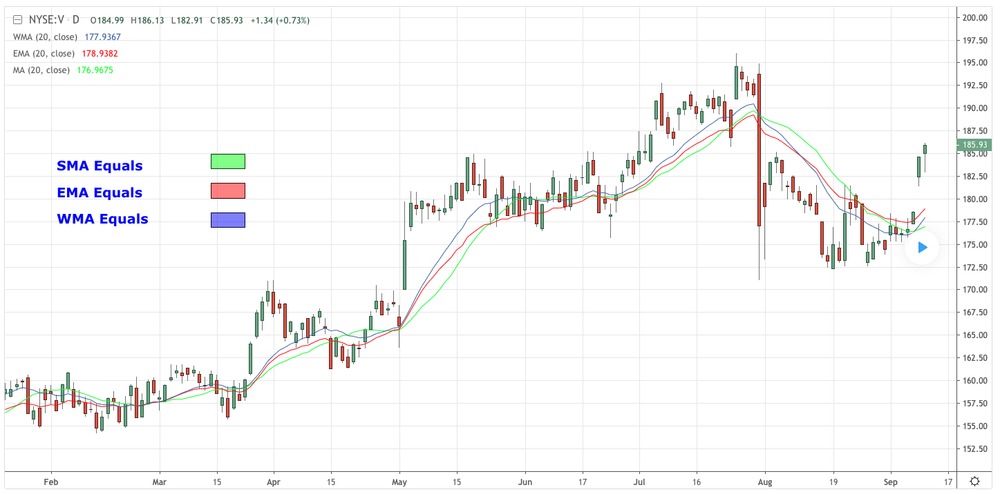

# Moving Average

> 移动平均线

[原文地址](https://www.tradingview.com/wiki/Moving_Average#Exponential_Moving_Average.28EMA.29)

## DEFINITION

> 定义

Moving Average (MA) is a price based, lagging (or reactive) indicator that displays the average price of a security over a set period of time. A Moving Average is a good way to gauge momentum as well as to confirm trends, and define areas of support and resistance. Essentially, Moving Averages smooth out the “noise” when trying to interpret charts. Noise is made up of fluctuations of both price and volume. Because a Moving Average is a lagging indicator and reacts to events that have already happened, it is not used as a predictive indicator but rather an interpretive one, used for confirmations and analysis. In fact, Moving Averages form the basis of several other well-known technical analysis tools such as Bollinger Bands and the MACD. There are a few different types of Moving Averages which all take the same basic premise and add a variation. Most notable are the Simple Moving Average (SMA), the Exponential Moving Average (EMA) and the Weighted Moving Average (WMA)

> 移动平均线（MA）是一个基于价格的，滞后（或反应）的指标，它显示一段时间内证券的平均价格。 移动平均线是衡量动量（势头）以及确认趋势，定义支撑和阻力区域的好方法。 从本质上讲，移动平均线在尝试解释图表时可以消除“噪音”。 噪音由价格和数量的波动组成。 **由于移动平均线是一个滞后指标并对已经发生的事件作出反应，因此它不用作预测指标，而是用作确认和分析的解释指标**。 事实上，移动平均线构成了其他几个着名的技术分析工具的基础，如布林带和 MACD。 有几种不同类型的移动平均线都采用相同的基本前提并添加变化。 最值得注意的是简单移动平均线（SMA），指数移动平均线（EMA）和加权移动平均线（WMA）

## TYPES

Moving Averages visualize the average price of a financial instrument over a specified period of time. However, there are a few different types of moving averages. They typically differ in the way that different data points are weighted or given significance.

### Simple Moving Average (SMA)

## THE BASICS

## WHAT TO LOOK FOR

## SUMMARY
