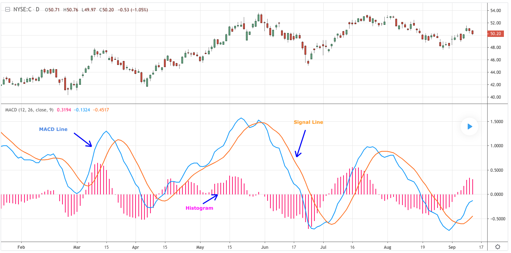

# MACD (Moving Average Convergence/Divergence)

> MACD（移动平均线收敛/发散）

[原文 URL](<https://www.tradingview.com/wiki/MACD_(Moving_Average_Convergence/Divergence)>)

## DEFINITION

> 定义

MACD is an extremely popular indicator used in technical analysis. MACD can be used to identify aspects of a security's overall trend. Most notably these aspects are momentum, as well as trend direction and duration. What makes MACD so informative is that it is actually the combination of two different types of indicators. First, MACD employs two Moving Averages of varying lengths (which are lagging indicators) to identify trend direction and duration. Then, MACD takes the difference in values between those two Moving Averages (MACD Line) and an EMA of those Moving Averages (Signal Line) and plots that difference between the two lines as a histogram which oscillates above and below a center Zero Line. The histogram is used as a good indication of a security's momentum.

> MACD 是技术分析中非常流行的指标。 MACD 可用于识别证券整体趋势的各个方面。 最值得注意的是，这些方面是动力，趋势方向和持续时间。 使 MACD 提供如此有用信息的原因在于它实际上是两种不同类型指标的组合。 首先，MACD 采用两个不同长度的移动平均线（滞后指标）来识别趋势方向和持续时间。 然后，MACD 获取这两个移动平均线（MACD 线）和那些移动平均线（信号线）的 EMA 之间的值的差值，并绘制两条线之间的差值作为在中心零线上下振荡的直方图。 直方图用作安全动量的良好指示。

## HISTORY

> 历史

The creation of the MACD as we know it can be split into two separate events.

1. In the 1970's, Gerald Appel created the MACD line.
2. In 1986, Thomas Aspray added the histogram feature to Appel's MACD.

Aspray's contribution served as a way to anticipate (and therefore cut down on lag) possible MACD crossovers which are a fundamental part of the indicator.

> 我们所知道的 MACD 的创建可以分成两个独立的事件。
>
> 1. 在 1970 年代，Gerald Appel 创建了 MACD 线。
> 2. 1986 年，托马斯·阿斯普雷（Thomas Aspray）为 Appel 的 MACD 添加了直方图特征。
>
> Aspray 的贡献是预测（并因此减少滞后）可能的 MACD 交叉的一种方式，这是指标的基本部分。

## CALCULATION

> 计算

```
MACD Line: (12-day EMA - 26-day EMA)
//MACD线:( 12天EMA - 26天EMA）

Signal Line: 9-day EMA of MACD Line
//信号线：MACD线的9日EMA

MACD Histogram: MACD Line - Signal Line
//MACD直方图：MACD线 - 信号线
```

## THE BASICS

> 基础



To fully understand the MACD indicator, it is first necessary to break down each of the indicator's components.

> 要完全理解 MACD 指标，首先必须细分每个指标的组成部分。

### The Three Major Components

> 三个主要的组成部分

1. The MACD Line

   MACD Line is a result of taking a longer term EMA and subtracting it from a shorter term EMA.

   > MACD 线是用短期 EMA（12 天） 减去长期 EMA（26 天） 的结果

   The most commonly used values are 26 days for the longer term EMA and 12 days for the shorter term EMA, but it is the trader's choice.

   > 最常用的值是长期 EMA 为 26 天，短期 EMA 为 12 天，但这是交易者的选择。

2. The Signal Line

   The Signal Line is an EMA of the MACD Line described in Component 1.

   > 信号线是 1 中描述的 MACD 线的 EMA。

   The trader can choose what period length EMA to use for the Signal Line however 9 is the most common.

   > 交易者可以选择用于信号线的周期长度 EMA，但 9 是最常见的。

3) The MACD Histogram

   As time advances, the difference between the MACD Line and Signal Line will continually differ. The MACD histogram takes that difference and plots it into an easily readable histogram. The difference between the two lines oscillates around a Zero Line.

   > 随着时间的推移，MACD 线和信号线之间的差异将不断变化。 MACD 直方图采用该差异并将其绘制成易于阅读的直方图。 两条线之间的差异围绕零线振荡。

A general interpretation of MACD is that when MACD is positive and the histogram value is increasing, then upside momentum is increasing. When MACD is negative and the histogram value is decreasing, then downside momentum is increasing.

> MACD 的一般解释是，当 MACD 为正（积极）并且直方图值增加时，则上行动量正在增加。 当 MACD 为负（消极）且直方图值下降时，下行动量正在增加。

## WHAT TO LOOK FOR

> 要找什么
