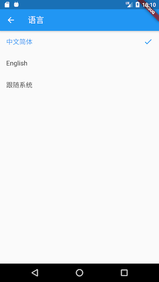
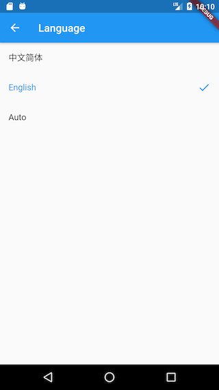
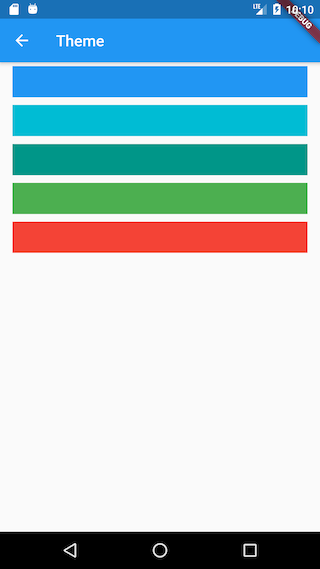

# 15.8 多语言和多主题

本实例APP中语言和主题都是可以设置的，而两者都是通过`ChangeNotifierProvider`来实现的：我们在`main`函数中使用了`Consumer2`，依赖了`ThemeModel`和`LocaleModel`，因此，当我们在语言和主题设置页更该当前的配置后，`Consumer2`的`builder`都会重新执行，构建一个新的`MaterialApp`，所以修改会立即生效。下面看一下语言和主题设置页的实现。

## 15.8.1 语言选择页

APP语言选择页提供三个选项：中文简体、美国英语、跟随系统。我们将当前APP使用的语言高亮显示，并且在后面添加一个“对号”图标，实现如下：

```dart
class LanguageRoute extends StatelessWidget {
  @override
  Widget build(BuildContext context) {
    var color = Theme.of(context).primaryColor;
    var localeModel = Provider.of<LocaleModel>(context);
    var gm = GmLocalizations.of(context);
    //构建语言选择项
    Widget _buildLanguageItem(String lan, value) {
      return ListTile(
        title: Text(
          lan,
          // 对APP当前语言进行高亮显示
          style: TextStyle(color: localeModel.locale == value ? color : null),
        ),
        trailing:
            localeModel.locale == value ? Icon(Icons.done, color: color) : null,
        onTap: () {
          // 更新locale后MaterialApp会重新build
          localeModel.locale = value;
        },
      );
    }

    return Scaffold(
      appBar: AppBar(
        title: Text(gm.language),
      ),
      body: ListView(
        children: <Widget>[
          _buildLanguageItem("中文简体", "zh_CN"),
          _buildLanguageItem("English", "en_US"),
          _buildLanguageItem(gm.auto, null),
        ],
      ),
    );
  }
}
```

上面代码逻辑很简单，唯一需要注意的是我们在`build(…)`方法里面定义了`_buildLanguageItem(…)`方法，它和在`LanguageRoute`类中定义该方法的区别就在于：在`build(…)`内定义的方法可以共享`build(...)`方法上下文中的变量，本例中是共享了`localeModel`。当然，如果`_buildLanguageItem(…)`的实现复杂一些的话不建议这样做，此时最好是将其作为`LanguageRoute`类的方法。该页面运行效果如图15-6、15-7所示：



切换语言后立即生效。

## 15.8.2 主题选择页

一个完整的主题`Theme`包括很多选项，这些选项在`ThemeData`中定义。本实例为了简单起见，我们只配置主题颜色。我们提供几种默认预定义的主题色供用户选择，用户点击一种色块后则更新主题。主题选择页的实现代码如下：

```dart
class ThemeChangeRoute extends StatelessWidget{
  @override
  Widget build(BuildContext context) {
    return Scaffold(
      appBar: AppBar(
        title: Text(GmLocalizations.of(context).theme),
      ),
      body: ListView( //显示主题色块
        children: Global.themes.map<Widget>((e) {
          return GestureDetector(
            child: Padding(
              padding: const EdgeInsets.symmetric(vertical: 5, horizontal: 16),
              child: Container(
                color: e,
                height: 40,
              ),
            ),
            onTap: () {
              //主题更新后，MaterialApp会重新build
              Provider.of<ThemeModel>(context).theme = e;
            },
          );
        }).toList(),
      ),
    );
  }
}
```

运行效果如图15-8所示：



点击其它主题色块后，APP主题色立马切换生效。
