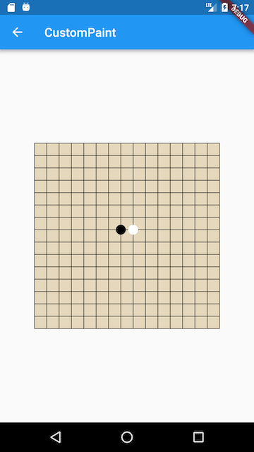

# 10.4 自绘组件 （CustomPaint与Canvas）

对于一些复杂或不规则的UI，我们可能无法通过组合其它组件的方式来实现，比如我们需要一个正六边形、一个渐变的圆形进度条、一个棋盘等。当然，有时候我们可以使用图片来实现，但在一些需要动态交互的场景静态图片也是实现不了的，比如要实现一个手写输入面板，这时，我们就需要来自己绘制UI外观。

几乎所有的UI系统都会提供一个自绘UI的接口，这个接口通常会提供一块2D画布`Canvas`，`Canvas`内部封装了一些基本绘制的API，开发者可以通过`Canvas`绘制各种自定义图形。在Flutter中，提供了一个`CustomPaint` 组件，它可以结合画笔`CustomPainter`来实现自定义图形绘制。

### CustomPaint

我们看看`CustomPaint`构造函数：

```dart
CustomPaint({
  Key key,
  this.painter, 
  this.foregroundPainter,
  this.size = Size.zero, 
  this.isComplex = false, 
  this.willChange = false, 
  Widget child, //子节点，可以为空
})
```

- `painter`: 背景画笔，会显示在子节点后面;
- `foregroundPainter`: 前景画笔，会显示在子节点前面
- `size`：当child为null时，代表默认绘制区域大小，如果有child则忽略此参数，画布尺寸则为child尺寸。如果有child但是想指定画布为特定大小，可以使用SizeBox包裹CustomPaint实现。
- `isComplex`：是否复杂的绘制，如果是，Flutter会应用一些缓存策略来减少重复渲染的开销。
- `willChange`：和`isComplex`配合使用，当启用缓存时，该属性代表在下一帧中绘制是否会改变。

可以看到，绘制时我们需要提供前景或背景画笔，两者也可以同时提供。我们的画笔需要继承`CustomPainter`类，我们在画笔类中实现真正的绘制逻辑。

#### 注意

如果`CustomPaint`有子节点，为了避免子节点不必要的重绘并提高性能，通常情况下都会将子节点包裹在`RepaintBoundary `组件中，这样会在绘制时就会创建一个新的绘制层（Layer），其子组件将在新的Layer上绘制，而父组件将在原来Layer上绘制，也就是说`RepaintBoundary` 子组件的绘制将独立于父组件的绘制，`RepaintBoundary`会隔离其子节点和`CustomPaint`本身的绘制边界。示例如下：

```dart
CustomPaint(
  size: Size(300, 300), //指定画布大小
  painter: MyPainter(),
  child: RepaintBoundary(child:...)), 
)
```

### CustomPainter

`CustomPainter`中提定义了一个虚函数`paint`：

```
void paint(Canvas canvas, Size size);
```

`paint`有两个参数:

- `Canvas`：一个画布，包括各种绘制方法，我们列出一下常用的方法：

  |API名称     | 功能   |
  | ---------- | ------ |
  | drawLine   | 画线   |
  | drawPoint  | 画点   |
  | drawPath   | 画路径 |
  | drawImage  | 画图像 |
  | drawRect   | 画矩形 |
  | drawCircle | 画圆   |
  | drawOval   | 画椭圆 |
  | drawArc    | 画圆弧 |

- `Size`：当前绘制区域大小。

### 画笔Paint

现在画布有了，我们最后还缺一个画笔，Flutter提供了`Paint`类来实现画笔。在`Paint`中，我们可以配置画笔的各种属性如粗细、颜色、样式等。如：

```dart
var paint = Paint() //创建一个画笔并配置其属性
  ..isAntiAlias = true //是否抗锯齿
  ..style = PaintingStyle.fill //画笔样式：填充
  ..color=Color(0x77cdb175);//画笔颜色
```

更多的配置属性读者可以参考Paint类定义。

### 示例：五子棋/盘

下面我们通过一个五子棋游戏中棋盘和棋子的绘制来演示自绘UI的过程，首先我们看一下我们的目标效果，如图10-3所示：



代码：

```dart
import 'package:flutter/material.dart';
import 'dart:math';

class CustomPaintRoute extends StatelessWidget {
  @override
  Widget build(BuildContext context) {
    return Center(
      child: CustomPaint(
        size: Size(300, 300), //指定画布大小
        painter: MyPainter(),
      ),
    );
  }
}

class MyPainter extends CustomPainter {
  @override
  void paint(Canvas canvas, Size size) {
    double eWidth = size.width / 15;
    double eHeight = size.height / 15;
      
    //画棋盘背景
    var paint = Paint()
      ..isAntiAlias = true
      ..style = PaintingStyle.fill //填充
      ..color = Color(0x77cdb175); //背景为纸黄色
    canvas.drawRect(Offset.zero & size, paint);

    //画棋盘网格
    paint
      ..style = PaintingStyle.stroke //线
      ..color = Colors.black87
      ..strokeWidth = 1.0;

    for (int i = 0; i <= 15; ++i) {
      double dy = eHeight * i;
      canvas.drawLine(Offset(0, dy), Offset(size.width, dy), paint);
    }

    for (int i = 0; i <= 15; ++i) {
      double dx = eWidth * i;
      canvas.drawLine(Offset(dx, 0), Offset(dx, size.height), paint);
    }

    //画一个黑子
    paint
      ..style = PaintingStyle.fill
      ..color = Colors.black;
    canvas.drawCircle(
      Offset(size.width / 2 - eWidth / 2, size.height / 2 - eHeight / 2),
      min(eWidth / 2, eHeight / 2) - 2,
      paint,
    );
      
    //画一个白子
    paint.color = Colors.white;
    canvas.drawCircle(
      Offset(size.width / 2 + eWidth / 2, size.height / 2 - eHeight / 2),
      min(eWidth / 2, eHeight / 2) - 2,
      paint,
    );
  }

  //在实际场景中正确利用此回调可以避免重绘开销，本示例我们简单的返回true
  @override
  bool shouldRepaint(CustomPainter oldDelegate) => true;
}
```

### 性能

绘制是比较昂贵的操作，所以我们在实现自绘控件时应该考虑到性能开销，下面是两条关于性能优化的建议：

- 尽可能的利用好`shouldRepaint`返回值；在UI树重新build时，控件在绘制前都会先调用该方法以确定是否有必要重绘；假如我们绘制的UI不依赖外部状态，那么就应该始终返回`false`，因为外部状态改变导致重新build时不会影响我们的UI外观；如果绘制依赖外部状态，那么我们就应该在`shouldRepaint`中判断依赖的状态是否改变，如果已改变则应返回`true`来重绘，反之则应返回`false`不需要重绘。

- 绘制尽可能多的分层；在上面五子棋的示例中，我们将棋盘和棋子的绘制放在了一起，这样会有一个问题：由于棋盘始终是不变的，用户每次落子时变的只是棋子，但是如果按照上面的代码来实现，每次绘制棋子时都要重新绘制一次棋盘，这是没必要的。优化的方法就是将棋盘单独抽为一个组件，并设置其`shouldRepaint`回调值为`false`，然后将棋盘组件作为背景。然后将棋子的绘制放到另一个组件中，这样每次落子时只需要绘制棋子。

### 总结

自绘控件非常强大，理论上可以实现任何2D图形外观，实际上Flutter提供的所有组件最终都是通过调用Canvas绘制出来的，只不过绘制的逻辑被封装起来了，读者有兴趣可以查看具有外观样式的组件源码，找到其对应的`RenderObject`对象，如`Text`对应的`RenderParagraph`对象最终会通过`Canvas`实现文本绘制逻辑。下一节我们会再通过一个自绘的圆形背景渐变进度条的实例来帮助读者加深印象。
