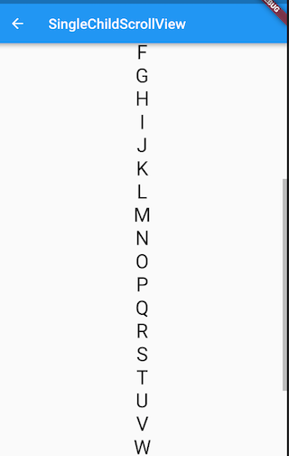

# 6.2 SingleChildScrollView

`SingleChildScrollView`类似于Android中的`ScrollView`，它只能接收一个子组件。定义如下：

```dart
SingleChildScrollView({
  this.scrollDirection = Axis.vertical, //滚动方向，默认是垂直方向
  this.reverse = false, 
  this.padding, 
  bool primary, 
  this.physics, 
  this.controller,
  this.child,
})
```

除了上一节我们介绍过的可滚动组件的通用属性外，我们重点看一下`reverse`和`primary`两个属性：

- `reverse`：该属性API文档解释是：是否按照阅读方向相反的方向滑动，如：`scrollDirection`值为`Axis.horizontal`，如果阅读方向是从左到右(取决于语言环境，阿拉伯语就是从右到左)。`reverse`为`true`时，那么滑动方向就是从右往左。其实此属性本质上是决定可滚动组件的初始滚动位置是在“头”还是“尾”，取`false`时，初始滚动位置在“头”，反之则在“尾”，读者可以自己试验。
- `primary`：指是否使用widget树中默认的`PrimaryScrollController`；当滑动方向为垂直方向（`scrollDirection`值为`Axis.vertical`）并且没有指定`controller`时，`primary`默认为`true`.

需要注意的是，通常`SingleChildScrollView`只应在期望的内容不会超过屏幕太多时使用，这是因为`SingleChildScrollView`不支持基于Sliver的延迟实例化模型，所以如果预计视口可能包含超出屏幕尺寸太多的内容时，那么使用`SingleChildScrollView`将会非常昂贵（性能差），此时应该使用一些支持Sliver延迟加载的可滚动组件，如`ListView`。

### 示例

下面是一个将大写字母A-Z沿垂直方向显示的例子，由于垂直方向空间会超过屏幕视口高度，所以我们使用`SingleChildScrollView`：

```dart
class SingleChildScrollViewTestRoute extends StatelessWidget {
  @override
  Widget build(BuildContext context) {
    String str = "ABCDEFGHIJKLMNOPQRSTUVWXYZ";
    return Scrollbar( // 显示进度条
      child: SingleChildScrollView(
        padding: EdgeInsets.all(16.0),
        child: Center(
          child: Column( 
            //动态创建一个List<Widget>  
            children: str.split("") 
                //每一个字母都用一个Text显示,字体为原来的两倍
                .map((c) => Text(c, textScaleFactor: 2.0,)) 
                .toList(),
          ),
        ),
      ),
    );
  }
}
```


运行效果如图6-1所示：



