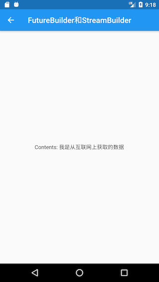

# 7.5 异步UI更新（FutureBuilder、StreamBuilder）

很多时候我们会依赖一些异步数据来动态更新UI，比如在打开一个页面时我们需要先从互联网上获取数据，在获取数据的过程中我们显式一个加载框，等获取到数据时我们再渲染页面；又比如我们想展示Stream（比如文件流、互联网数据接收流）的进度。当然，通过StatefulWidget我们完全可以实现上述这些功能。但由于在实际开发中依赖异步数据更新UI的这种场景非常常见，因此Flutter专门提供了`FutureBuilder`和`StreamBuilder`两个组件来快速实现这种功能。

## 7.5.1 FutureBuilder

`FutureBuilder`会依赖一个`Future`，它会根据所依赖的`Future`的状态来动态构建自身。我们看一下`FutureBuilder`构造函数：

```dart
FutureBuilder({
  this.future,
  this.initialData,
  @required this.builder,
})
```

- `future`：`FutureBuilder`依赖的`Future`，通常是一个异步耗时任务。

- `initialData`：初始数据，用户设置默认数据。

- `builder`：Widget构建器；该构建器会在`Future`执行的不同阶段被多次调用，构建器签名如下：

  ```dart
  Function (BuildContext context, AsyncSnapshot snapshot) 
  ```

  `snapshot`会包含当前异步任务的状态信息及结果信息 ，比如我们可以通过`snapshot.connectionState`获取异步任务的状态信息、通过`snapshot.hasError`判断异步任务是否有错误等等，完整的定义读者可以查看`AsyncSnapshot`类定义。
  
  另外，`FutureBuilder`的`builder`函数签名和`StreamBuilder`的`builder`是相同的。

### 示例

我们实现一个路由，当该路由打开时我们从网上获取数据，获取数据时弹一个加载框；获取结束时，如果成功则显示获取到的数据，如果失败则显示错误。由于我们还没有介绍在flutter中如何发起网络请求，所以在这里我们不真正去网络请求数据，而是模拟一下这个过程，隔3秒后返回一个字符串：

```dart
Future<String> mockNetworkData() async {
  return Future.delayed(Duration(seconds: 2), () => "我是从互联网上获取的数据");
}
```

`FutureBuilder`使用代码如下：

```dart
...
Widget build(BuildContext context) {
  return Center(
    child: FutureBuilder<String>(
      future: mockNetworkData(),
      builder: (BuildContext context, AsyncSnapshot snapshot) {
        // 请求已结束
        if (snapshot.connectionState == ConnectionState.done) {
          if (snapshot.hasError) {
            // 请求失败，显示错误
            return Text("Error: ${snapshot.error}");
          } else {
            // 请求成功，显示数据
            return Text("Contents: ${snapshot.data}");
          }
        } else {
          // 请求未结束，显示loading
          return CircularProgressIndicator();
        }
      },
    ),
  );
}
```

运行结果如图7-8、7-9所示：



上面代码中我们在`builder`中根据当前异步任务状态`ConnectionState`来返回不同的widget。`ConnectionState`是一个枚举类，定义如下：

```dart
enum ConnectionState {
  /// 当前没有异步任务，比如[FutureBuilder]的[future]为null时
  none,

  /// 异步任务处于等待状态
  waiting,

  /// Stream处于激活状态（流上已经有数据传递了），对于FutureBuilder没有该状态。
  active,

  /// 异步任务已经终止.
  done,
}
```

注意，`ConnectionState.active`只在`StreamBuilder`中才会出现。


## 7.5.2 StreamBuilder

我们知道，在Dart中`Stream` 也是用于接收异步事件数据，和`Future` 不同的是，它可以接收多个异步操作的结果，它常用于会多次读取数据的异步任务场景，如网络内容下载、文件读写等。`StreamBuilder`正是用于配合`Stream`来展示流上事件（数据）变化的UI组件。下面看一下`StreamBuilder`的默认构造函数：

```dart
StreamBuilder({
  Key key,
  this.initialData,
  Stream<T> stream,
  @required this.builder,
}) 
```

可以看到和`FutureBuilder`的构造函数只有一点不同：前者需要一个`future`，而后者需要一个`stream`。

### 示例

我们创建一个计时器的示例：每隔1秒，计数加1。这里，我们使用`Stream`来实现每隔一秒生成一个数字:

```dart
Stream<int> counter() {
  return Stream.periodic(Duration(seconds: 1), (i) {
    return i;
  });
}
```

`StreamBuilder`使用代码如下：

```dart
  
 Widget build(BuildContext context) {
    return StreamBuilder<int>(
      stream: counter(), //
      //initialData: ,// a Stream<int> or null
      builder: (BuildContext context, AsyncSnapshot<int> snapshot) {
        if (snapshot.hasError)
          return Text('Error: ${snapshot.error}');
        switch (snapshot.connectionState) {
          case ConnectionState.none:
            return Text('没有Stream');
          case ConnectionState.waiting:
            return Text('等待数据...');
          case ConnectionState.active:
            return Text('active: ${snapshot.data}');
          case ConnectionState.done:
            return Text('Stream已关闭');
        }
        return null; // unreachable
      },
    );
 }
```

读者可以自己运行本示例查看运行结果。注意，本示例只是为了演示`StreamBuilder`的使用，在实战中，凡是UI会依赖多个异步数据而发生变化的场景都可以使用`StreamBuilder`。