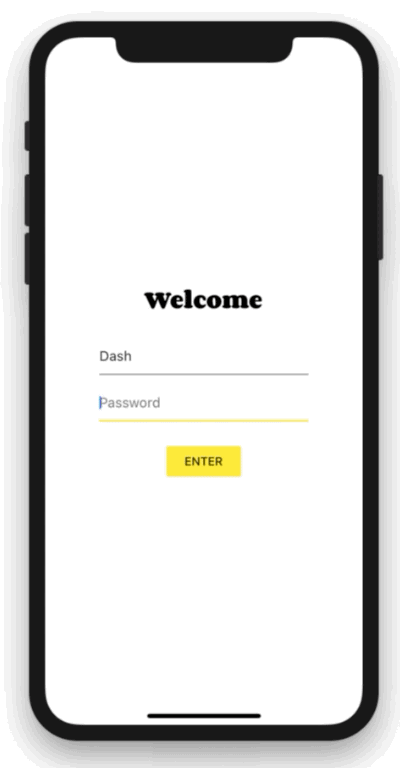

# Simple app state management

Now that you know about declarative UI programming and the difference between ephemeral and app state, you are ready to learn about simple app state management.

> 现在您已了解声明性 UI 编程以及短暂状态与应用程序状态之间的区别，您已准备好了解简单的应用程序状态管理。

On this page, we are going to be using the provider package. If you are new to Flutter and you don’t have a strong reason to choose another approach (Redux, Rx, hooks, etc.), this is probably the approach you should start with. provider is easy to understand and it doesn’t use much code. It also uses concepts that are applicable in every other approach.

> 在此页面上，我们将使用 provider 程序包。 如果您是 Flutter 的新手并且没有充分的理由选择其他方法（Redux，Rx，钩子等），这可能是您应该开始的方法。 provider 很容易理解，并且不会使用太多代码。 它还使用适用于所有其他方法的概念。

That said, if you have strong background in state management from other reactive frameworks, you will find packages and tutorials listed on the following page.

> 也就是说，如果您在其他反应框架中具有强大的状态管理背景，那么您将在下一页上找到包和教程。

## Our example



For illustration, consider the following simple app.

> 为了便于说明，请考虑以下简单应用。

The app has three separate screens: a login prompt, a catalog, and a cart (represented by the MyLoginScreen, MyCatalog, and MyCart widgets, respectively). It could be a shopping app, but you can imagine the same structure in a simple social networking app (replace catalog for “wall” and cart for “favorites”).

> 该应用程序有三个独立的屏幕：登录提示，目录和购物车（分别由 MyLoginScreen，MyCatalog 和 MyCart 小部件表示）。 它可能是一个购物应用程序，但您可以在一个简单的社交网络应用程序中想象相同的结构（替换“墙”的目录和“收藏夹”的购物车）。

The catalog screen includes a custom app bar (MyAppBar) and a scrolling view of many list items (MyListItems).

> 目录屏幕包括自定义应用栏（MyAppBar）和许多列表项（MyListItems）的滚动视图。

Here’s the app visualized as a widget tree.

> 这是可视化为小部件树的应用程序。


So we have at least 6 subclasses of Widget. Many of them will need access to state that “belongs” elsewhere. For example, each MyListItem will want to be able to add to cart. It might also want to see if the item that it’s displaying is already in the cart.

> 所以我们至少有 6 个 Widget 子类。 他们中的许多将需要访问“属于”其他地方的状态。 例如，每个 MyListItem 都希望能够添加到购物车。 它可能还想查看它显示的项目是否已经在购物车中。

This takes us to our first question: where should we put the current state of the cart?

> 这就把我们带到了第一个问题：我们应该把购物车的当前状态放在哪里？

## Lifting state up

> 提升状态

In Flutter, it makes sense to keep the state above the widgets that use it.

> 在 Flutter 中，将状态保持在使用它的小部件之上是有意义的。

Why? In declarative frameworks like Flutter, if you want to change the UI, you have to rebuild it. There is no easy way to have MyCart.updateWith(somethingNew). In other words, it’s hard to imperatively change a widget from outside, by calling a method on it. And even if you could make this work, you would be fighting the framework instead of letting it help you.

> 为什么？ 在像 Flutter 这样的声明性框架中，如果要更改 UI，则必须重新构建它。 没有简单的方法可以使用 MyCart.updateWith（somethingNew）。 换句话说，通过调用 widget 上面的方法从外部命令式地更改 widget 很难。 即使你能做到这一点，你也会对框架进行斗争，而不是让它帮助你。

```dart
// BAD: DO NOT DO THIS
void myTapHandler() {
  var cartWidget = somehowGetMyCartWidget();
  cartWidget.updateWith(item);
}
```

Even if you get the above code to work, you will then have to deal with the following in the MyCart widget:

> 即使您使用上述代码（即使上面的代码有效），您也必须在 MyCart 小部件中处理以下内容：

```dart
// BAD: DO NOT DO THIS
Widget build(BuildContext context) {
  return SomeWidget(
    // The initial state of the cart.
  );
}

void updateWith(Item item) {
  // Somehow you need to change the UI from here.
}
```

You would need to take into consideration the current state of the UI and apply the new data to it. It’s hard to avoid bugs this way.

> 您需要考虑 UI 的当前状态并将新数据应用于它。 以这种方式很难避免错误。

In Flutter, you construct a new widget every time its contents change. Instead of MyCart.updateWith(somethingNew) (a method call) you use MyCart(contents) (a constructor). Because you can only construct new widgets in the build methods of their parents, if you want to change contents, it needs to live in MyCart’s parent or above.

> **在 Flutter 中，每次内容更改时都会构造一个新小部件**。 而不是 MyCart.updateWith（somethingNew）（方法调用），您使用 MyCart（内容）（构造函数）。 因为你只能在父母的构建方法中构建新的小部件，如果你想改变内容，它需要住在 MyCart 的父级或更高级别。

```dart
// GOOD
void myTapHandler(BuildContext context) {
  var cartModel = somehowGetMyCartModel(context);
  cartModel.add(item);
}
```

Now MyCart has only one code path for building any version of the UI.

> 现在，MyCart 只有一个代码路径来构建任何版本的 UI。

```dart
// GOOD
Widget build(BuildContext context) {
  var cartModel = somehowGetMyCartModel(context);
  return SomeWidget(
    // Just construct the UI once, using the current state of the cart.
    // ···
  );
}
```

In our example, contents needs to live in MyApp. Whenever it changes, it rebuilds MyCart from above (more on that later). Because of this, MyCart doesn’t need to worry about lifecycle—it just declares what to show for any given contents. When that changes, the old MyCart widget disappears and is completely replaced by the new one.

> 在我们的示例中，内容需要存在于 MyApp 中。 **每当它发生变化时，它都会从上面重建 MyCart**（稍后会详细介绍）。 因此，**MyCart 不需要担心生命周期** - 它只是声明了为任何给定数据显示什么。 当更改时，**旧的 MyCart 小部件将消失，并完全被新的小部件取代**。


**This is what we mean when we say that widgets are immutable. They don’t change—they get replaced.**

> **当我们说小部件是不可变的时，这就是我们的意思。 他们没有改变 - 他们被取代了。**

Now that we know where to put the state of the cart, let’s see how to access it.

> 现在我们知道了购物车状态的位置，让我们看看如何访问它。

## Accessing the state

> 访问状态

When user clicks on one of the items in the catalog, it’s added to the cart. But since the cart lives above MyListItem, how do we do that?

> 当用户单击目录中的某个项目时，它会被添加到购物车中。 但由于购物车位于 MyListItem 之上，我们该如何做？

A simple option is to provide a callback that MyListItem can call when it is clicked. Dart’s functions are first class objects, so you can pass them around any way you want. So, inside MyCatalog you can have the following:

> 一个简单的选项是提供单击 MyListItem 时可以调用的回调。 Dart 的函数是一等的类对象，因此您可以以任何方式传递它们。 因此，在 MyCatalog 中，您可以拥有以下内容：

```dart
@override
Widget build(BuildContext context) {
  return SomeWidget(
    // Construct the widget, passing it a reference to the method above.
    MyListItem(myTapCallback),
  );
}

void myTapCallback(Item item) {
  print('user tapped on $item');
}
```

This works okay, but for app state that you need to modify from many different places, you’d have to pass around a lot of callbacks—which gets old pretty quickly.

> 这样可以正常工作，但对于 app 状态，您需要从许多不同的地方进行修改，您必须传递大量的回调 - 这很快就会变老。

Fortunately, Flutter has mechanisms for widgets to provide data and services to their descendants (in other words, not just their children, but any widgets below them). As you would expect from Flutter, where Everything is a Widget™, these mechanisms are just special kinds of widgets—InheritedWidget, InheritedNotifier, InheritedModel, and more. We won’t be covering those here, because they are a bit low-level for what we’re trying to do.

> 幸运的是，Flutter 有为小部件的后代提供数据和服务的机制（换句话说，不仅仅是他们的孩子，还有他们下面的任何小部件）。 正如您对 Flutter 所期望的那样，Flutter 中一切都是 Widget™，这些机制只是特殊类型的小部件 - InheritedWidget，InheritedNotifier，InheritedModel 等。 我们不会在这里介绍那些，因为它们对我们想要做的事情来说有点低级。

Instead, we are going to use a package that works with the low-level widgets but is simple to use. It’s called provider.

> 相反，我们将使用与低级小部件一起使用但易于使用的包。 它叫做 provider。

With provider, you don’t need to worry about callbacks or InheritedWidgets. But you do need to understand 3 concepts:

> 使用 provider，您无需担心回调或 InheritedWidgets。 但你确实需要理解 3 个概念：

- ChangeNotifier
- ChangeNotifierProvider
- Consumer

> - 改变通知者
> - 改变通知者提供者
> - 消费者

## ChangeNotifier

ChangeNotifier is a simple class included in the Flutter SDK which provides change notification to its listeners. In other words, if something is a ChangeNotifier, you can subscribe to its changes. (It is a form of Observable, for those familiar with the term.)

> **hangeNotifier 是 Flutter SDK 中包含的一个简单类，它向其监听器提供更改通知**。 换句话说，如果某些内容是 ChangeNotifier，您可以订阅其更改。 （对于熟悉该术语的人来说，这是 Observable 的一种形式。）

In provider, ChangeNotifier is one way to encapsulate your application state. For very simple apps, you get by with a single ChangeNotifier. In complex ones, you’ll have several models, and therefore several ChangeNotifiers. (You don’t need to use ChangeNotifier with provider at all, but it’s an easy class to work with.)

> **在 provider 中，ChangeNotifier 是封装应用程序状态的一种方法**。 对于非常简单的应用程序，您可以使用一个 ChangeNotifier。 在复杂的 app 中，你将有几个模型，因此有几个 ChangeNotifiers。 （您根本不需要将 ChangeNotifier 与 provider 一起使用，但这是一个易于使用的类。）

In our shopping app example, we want to manage the state of the cart in a ChangeNotifier. We create a new class that extends it, like so:

> 在我们的购物应用示例中，我们想在一个 ChangeNotifier 中管理购物车的状态。 我们创建了一个扩展它的新类，如下所示：

```dart
class CartModel extends ChangeNotifier {
  /// Internal, private state of the cart.
  final List<Item> _items = [];

  /// An unmodifiable view of the items in the cart.
  UnmodifiableListView<Item> get items => UnmodifiableListView(_items);

  /// The current total price of all items (assuming all items cost $42).
  int get totalPrice => _items.length * 42;

  /// Adds [item] to cart. This is the only way to modify the cart from outside.
  void add(Item item) {
    _items.add(item);
    // This call tells the widgets that are listening to this model to rebuild.
    notifyListeners();
  }
}
```

The only code that is specific to ChangeNotifier is the call to notifyListeners(). Call this method any time the model changes in a way that might change your app’s UI. Everything else in CartModel is the model itself and its business logic.

> 唯一特定于 ChangeNotifier 的代码是对 notifyListeners（）的调用。 只要模型发生变化，就可以更改应用程序的 UI，请调用此方法。 CartModel 中的其他所有内容都是模型本身及其业务逻辑。

ChangeNotifier is part of flutter:foundation and doesn’t depend on any higher-level classes in Flutter. It’s easily testable (you don’t even need to use widget testing for it). For example, here’s a simple unit test of CartModel:

> ChangeNotifier 是 flutter：foundation 的一部分，并不依赖于 Flutter 中的任何更高级别的类。 它很容易测试（你甚至不需要使用小部件测试）。 例如，这是 CartModel 的简单单元测试：

```dart
test('adding item increases total cost', () {
  final cart = CartModel();
  final startingPrice = cart.totalPrice;
  cart.addListener(() {
    expect(cart.totalPrice, greaterThan(startingPrice));
  });
  cart.add(Item('Dash'));
});
```

## ChangeNotifierProvider

ChangeNotifierProvider is the widget that provides an instance of a ChangeNotifier to its descendants. It comes from the provider package.

> **ChangeNotifierProvider 是一个小部件，它为其后代提供 ChangeNotifier 的实例**。 它来自 provider 程序包。

We already know where to put ChangeNotifierProvider: above the widgets that will need to access it. In the case of CartModel, that means somewhere above both MyCart and MyCatalog.

> **我们已经知道将 ChangeNotifierProvider 置于何处**：在需要访问它的小部件之上。 对于 CartModel，这意味着在 MyCart 和 MyCatalog 之上。

You don’t want to place ChangeNotifierProvider higher than necessary (because you don’t want to pollute the scope). But in our case, the only widget that is on top of both MyCart and MyCatalog is MyApp.

> 您不希望将 ChangeNotifierProvider 置于必要位置之上（因为您不希望污染作用域/范围）。 但在我们的案例中，MyCart 和 MyCatalog 之上唯一的小部件是 MyApp。

```dart
void main() {
  runApp(
    ChangeNotifierProvider(
      builder: (context) => CartModel(),
      child: MyApp(),
    ),
  );
}
```

Note that we’re defining a builder which will create a new instance of CartModel. ChangeNotifierProvider is smart enough not to rebuild CartModel unless absolutely necessary. It will also automatically call dispose() on CartModel when the instance is no longer needed.

> 请注意，我们正在定义一个构建器，它将创建一个 CartModel 的新实例。 ChangeNotifierProvider 非常聪明，除非绝对必要，否则不会重建 CartModel。 当不再需要实例时，它还会自动在 CartModel 上调用 dispose（）。

If you want to provide more than one class, you can use MultiProvider:

> 如果要提供多个类，可以使用 MultiProvider：

```dart
void main() {
  runApp(
    MultiProvider(
      providers: [
        ChangeNotifierProvider(builder: (context) => CartModel()),
        Provider(builder: (context) => SomeOtherClass()),
      ],
      child: MyApp(),
    ),
  );
}
```

## Consumer

> 消费者

Now that CartModel is provided to widgets in our app through the ChangeNotifierProvider declaration at the top, we can start using it.

> 现在 CartModel 通过顶部的 ChangeNotifierProvider 声明提供给我们应用程序中的小部件，我们可以开始使用它。

This is done through the Consumer widget.

> 这是通过 Consumer 小部件完成的。

```dart
return Consumer<CartModel>(
  builder: (context, cart, child) {
    return Text("Total price: ${cart.totalPrice}");
  },
);
```

We must specify the type of the model that we want to access. In this case, we want CartModel, so we write Consumer<CartModel>. If you don’t specify the generic (<CartModel>), the provider package won’t be able to help you. provider is based on types, and without the type, it doesn’t know what you want.

> **我们必须指定我们想要访问的模型的类型**。在这种情况下，我们需要 CartModel，因此我们编写 Consumer <CartModel>。如果您未指定通用（<CartModel>），则 provider 包将无法帮助您。provider 基于类型，没有类型，它不知道你想要什么。

The only required argument of the Consumer widget is the builder. Builder is a function that is called whenever the ChangeNotifier changes. (In other words, when you call notifyListeners() in your model, all the builder methods of all the corresponding Consumer widgets are called.)

> **Consumer 小部件唯一必需的参数是 builder**。 Builder 是一个在 ChangeNotifier 更改时调用的函数。 （换句话说，当您在模型中调用 notifyListeners（）时，将调用所有相应 Consumer 小部件的所有 builder 方法。）

The builder is called with three arguments. The first one is context, which you also get in every build method.

> 使用三个参数调用 builder。**第一个是 context 上下文**，您也可以在每个 build 方法中获得它。

The second argument of the builder function is the instance of the ChangeNotifier. It’s what we were asking for in the first place. You can use the data in the model to define what the UI should look like at any given point.

> builder 函数的**第二个参数是 ChangeNotifier 的实例**。这是我们首先要求的。您可以使用模型中的数据来定义 UI 在任何给定点的外观。

The third argument is child, which is there for optimization. If you have a large widget subtree under your Consumer that doesn’t change when the model changes, you can construct it once and get it through the builder.

> **第三个参数是 child，它用于优化**。如果您的 Consumer 下有一个大的窗口小部件子树，在模型更改时不会更改，您可以构造一次并通过 builder 获取它。

```dart
return Consumer<CartModel>(
  builder: (context, cart, child) => Stack(
        children: [
          // Use SomeExpensiveWidget here, without rebuilding every time.
          child,
          Text("Total price: ${cart.totalPrice}"),
        ],
      ),
  // Build the expensive widget here.
  child: SomeExpensiveWidget(),
);
```

It is best practice to put your Consumer widgets as deep in the tree as possible. You don’t want to rebuild large portions of the UI just because some detail somewhere changed.

> **最佳做法是将您的 Consumer 小部件尽可能深入树中**。 您不希望重建 UI 的大部分内容只是因为某些细节发生了变化。

```dart
// DON'T DO THIS
return Consumer<CartModel>(
  builder: (context, cart, child) {
    return HumongousWidget(
      // ...
      child: AnotherMonstrousWidget(
        // ...
        child: Text('Total price: ${cart.totalPrice}'),
      ),
    );
  },
);
```

Instead:

```dart
// DO THIS
return HumongousWidget(
  // ...
  child: AnotherMonstrousWidget(
    // ...
    child: Consumer<CartModel>(
      builder: (context, cart, child) {
        return Text('Total price: ${cart.totalPrice}');
      },
    ),
  ),
);
```

### Provider.of

Sometimes, you don’t really need the data in the model to change the UI but you still need to access it. For example, a ClearCart button wants to allow the user to remove everything from the cart. It doesn’t need to display the contents of the cart, it just needs to call the clear() method.

> **有时，您并不真正需要模型中的数据来更改 UI，但您仍然需要访问它**。 例如，ClearCart 按钮希望允许用户从购物车中删除所有内容。 它不需要显示购物车的内容，只需要调用 clear（）方法即可。

We could use Consumer<CartModel> for this, but that would be wasteful. We’d be asking the framework to rebuild a widget that doesn’t need to be rebuilt.

> 我们可以使用 Consumer <CartModel>，但这样做会很浪费。 我们要求框架重建一个不需要重建的小部件。

For this use case, we can use Provider.of, with the listen parameter set to false.

> 对于此用例，我们可以使用 Provider.of，并将 listen 参数设置为 false。

```dart
Provider.of<CartModel>(context, listen: false).add(item);
```

Using the above line in a build method will not cause this widget to rebuild when notifyListeners is called.

> 在调用 notifyListeners 时，在 build 方法中使用上述代码不会导致此小部件重建。

## Putting it all together

You can [check out the example](https://github.com/flutter/samples/tree/master/provider_shopper) covered in this article. If you want something simpler, you can see how the simple Counter app looks like when [built with provider](https://github.com/flutter/samples/tree/master/provider_counter).

> 您可以查看本文中介绍的示例。 如果您想要更简单的东西，您可以看到使用 provider 构建简单的 Counter 应用程序时的样子。

When you’re ready to play around with provider yourself, don’t forget to add the dependency on it to your pubspec.yaml first.

> 当您准备好自己玩 provider 时，不要忘记首先将它的依赖项添加到 pubspec.yaml。

```yaml
name: my_name
description: Blah blah blah.

# ...

dependencies:
  flutter:
    sdk: flutter

  provider: ^3.0.0

dev_dependencies:
  # ...
```

Now you can import 'package:provider/provider.dart'; and start building.
