# 简介

## 日本文字的构成

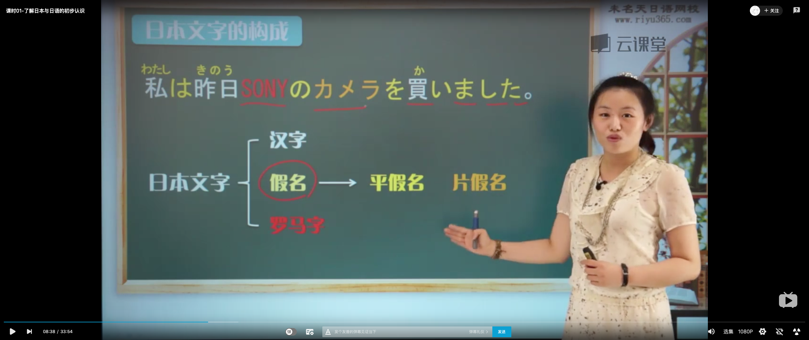

## 日语汉字

### 字形比较

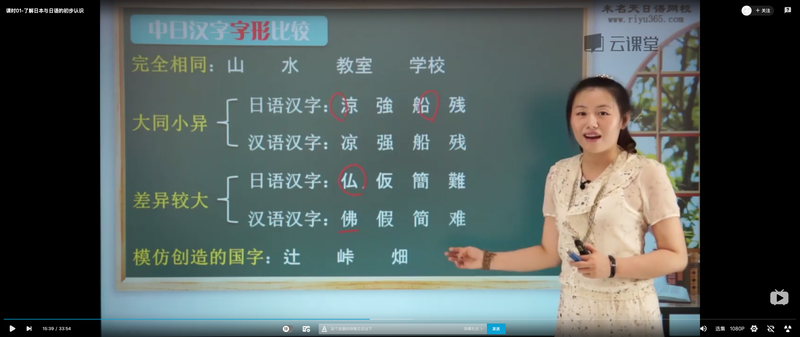

### 字义比较

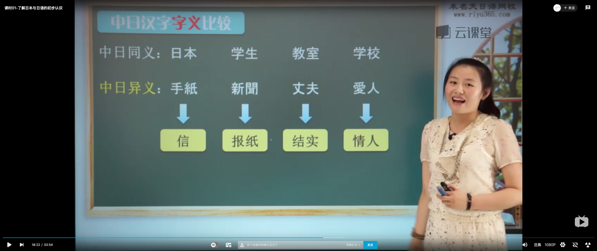

### 日语发音方式

音读和训读
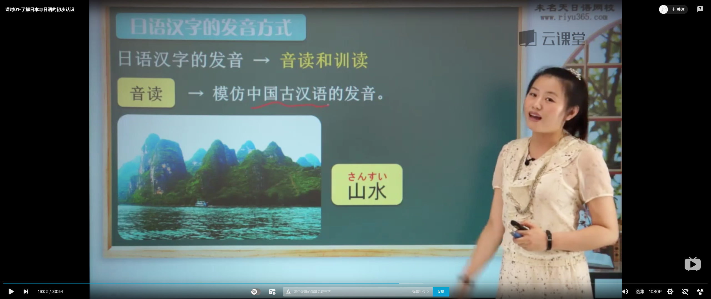
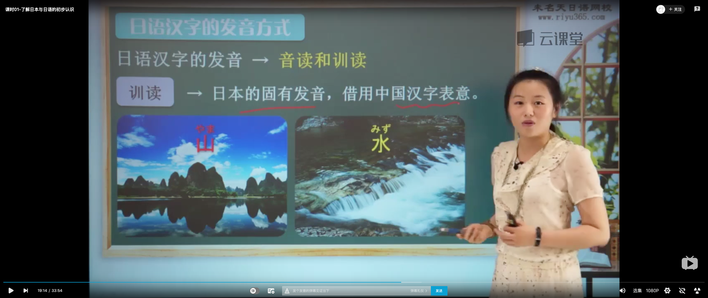
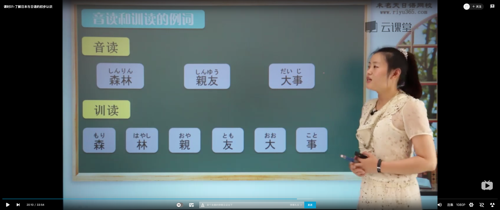

## 假名

### 分类

平假名和片假名

### 平假名和片假名的关系

完全相等，一一对应，同样的发音，不同的写法
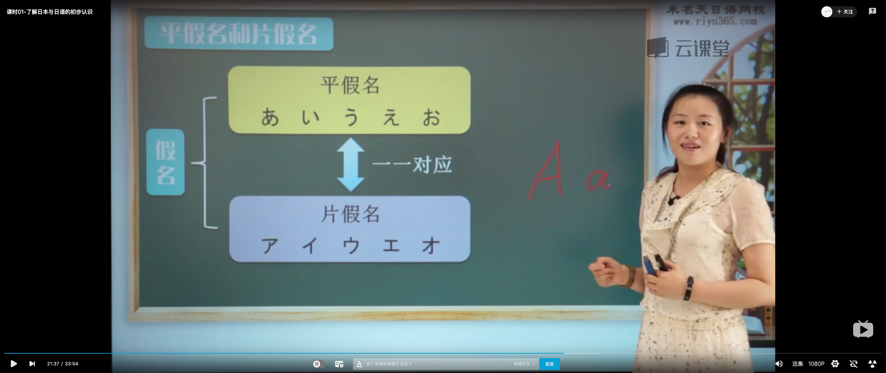

### 平假名

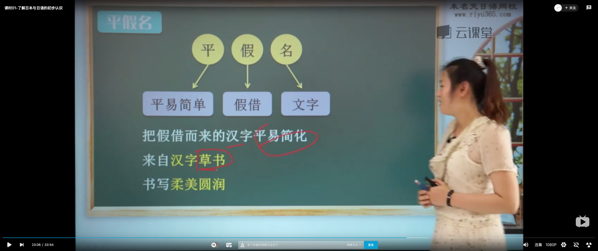
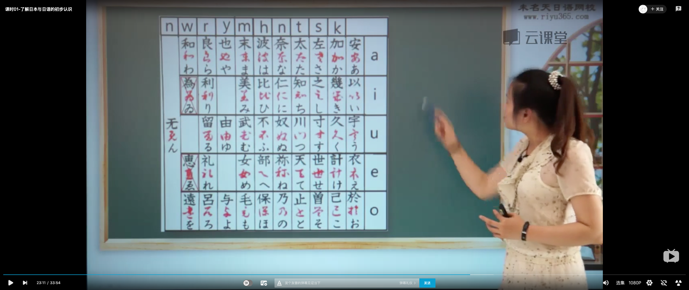

### 片假名

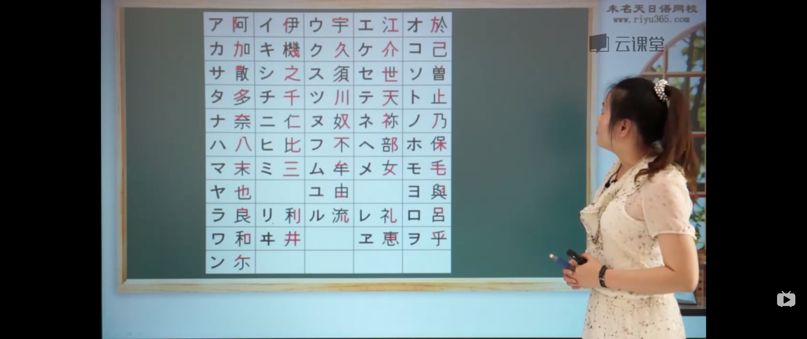

#### 片假名的用途

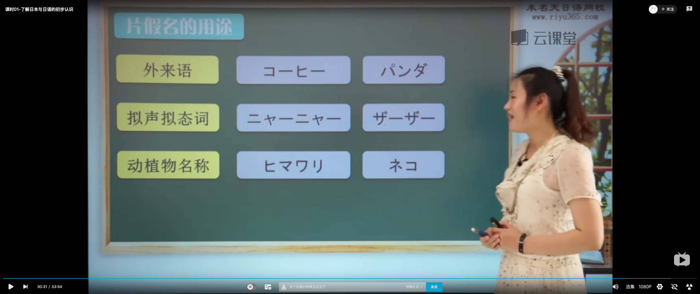

## 罗马字

### 罗马字的使用范围

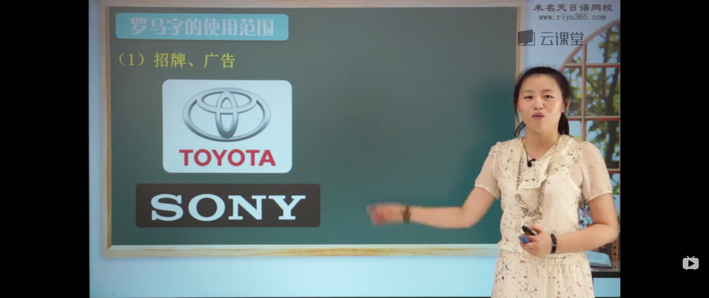

