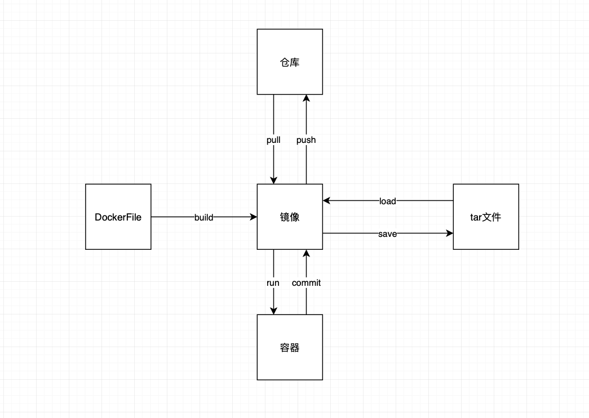

# docker 简介



## 概念

- docker：类似一个虚拟机
- image（镜像）：类似虚拟机的镜像文件，保存程序和它的依赖，静态没有运行的
- container（容器）：类似一个正在运行的虚拟机，保存程序和它的依赖，动态运行的

## 为什么-why

Docker enables developers to easily pack, ship, and run any application as a lightweight, portable, self-sufficient container, which can run virtually anywhere. ... In addition, Docker containers are easy to deploy in a cloud.

## 是什么-what

## 怎么用-how

### image

#### 拉取远程 image

```bash
docker pull imageName

docker image pull imageName
```

#### 查看 image

```bash
docker images

docker image ls
```

#### 删除 image

```bash
docker rmi imageName
```

### container

#### 运行程序/image-->container

```bash
docker run imageName ：docker run centos /bin/echo 'hello'

docker container run imageName
```

#### 带互动的交互的 container

```bash
docker run --interactive(-i) --tty(-t) centos /bin/bash(bash)
```

--interactive/-i：交互的

--tty/-t：附加一个终端

/bin/bash：终端的位置

- 退出交互命令行

```bash
exit
```

#### 在后台运行的 container

```bash
docker run --detach/-d centos ping ninghao.net
```

#### 命名 container

```bash
docker run --name dockerName imageName ：docker run --name greeting centos ls
```

#### 列出 container

- 正在运行的 container

```bash
docker ps

docker container ls
```

- 所有的 container

```bash
docker ps --all/-a

docker container ls  --all/-a
```

#### 删除 container

```bash
docker rm containerId/containerName
```

#### 停止 container

```bash
docker stop containerId/containerName
```

#### 重启 container

```bash
docker restart containerId/containerName
```

#### 运行 container

```bash
docker start containerId/containerName
```

#### 查看 container 日志

```bash
docker logs containerId/containerName
```

## 参考

[docker 入门](http://www.ruanyifeng.com/blog/2018/02/docker-tutorial.html)
