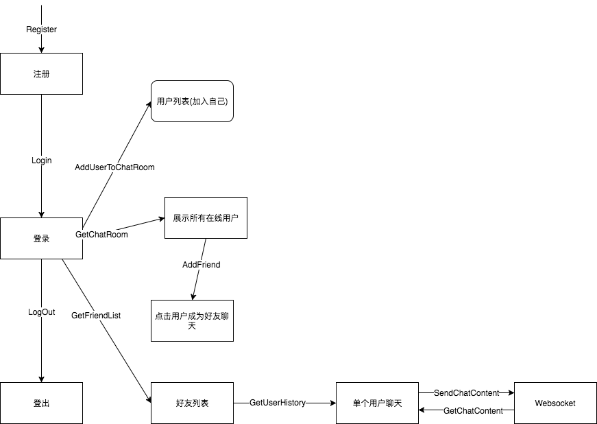

# 一套完整的前端开发流程让你的开发事半功倍

## 前言

博客大概三个月没更新，原因很简单，准备面试，准备实习，实习中，拿到 offer。在这个流程中没有多余的时间让我静下来好好写博客。

写博客需要一种心情。尤其在实习过程中深刻体会到未来工作后博客的更新频率可能还会降低。

不是没有东西可写，能写的东西好多，比如如何准备面试，实习，实习中如何注重提升自己，如何有效总结。以及如何管理自己的知识体系等等。

能讲的很多，其实原本不打算继续写博客，**但是想到以前有读者专门通过博客等途径找到我个人联系方式二话不说直接打钱支持…我觉得还是得写一些干货**。因此我打算先写两篇。

下面我将讲的内容，在我的知乎 timeline 从来没见过，而且在过去两年我的咨询平台抓取的文章中也很少见。因为很少有人会去总结这部分内容，而这部分内容恰恰是前端开发最能提高效率的部分，有些是从科班课程里总结添加的，有些是从公司里学到的，我相信对野生前端应该还是很有帮助的。对在职的希望给你们一些启发。

## 正文

在现在的前端大环境中，充斥着一种急切，新手们忙于各种框架学习，工作的人忙于各种业务开发。我们也在寻求一种能够帮助我们提高开发，提高学习效率的东西。而开发流程都很容易被人忽略。

**从我自身来讲以前开发是这样的：**

> 确定需求 -> 搜集资料 -> 进行开发

后来进行全栈开发还需要考虑后端数据库设计，考虑整体架构。

以前的我注重框架的实践，因此很多项目在构思的时候会想，在这个框架中应该如何实现这个功能，原生怎么实现。

然后在很多项目实际开发中一次次的返工，让我知道有些东西我疏忽了。

经过漫长的碰壁，总结，不断实习，不断开发项目，阅读经典书籍以及学习过程中，我总结了一套当前最适合自己的前端开发流程。

它其实是软件开发流程的一个延伸。

这里我将自己当前使用的开发流程，完整的全栈开发思路分享。

### 总体步骤

> 需求分析 -> 前后端交互逻辑 -> 流程图 ->

> 数据库字段确定 -> 数据表设计 -> 完成接口文档

### 需求分析

需求分析很多人觉得是产品经理的活，但其实实际开发中你已经潜意识中进行了这项活动。但是有个重点就是将你的需求分析文档书面化。为什么强调书面化，前辈教导是为了让你的未来开发以及小组团队协作时，让你的队友知道做什么。在未来的开发中你不需要重复的再去思考需求是什么，而是一开始需求已经确定，你在未来开发中可以时常回顾。（当然未来需求改动这部分我们也可以在需求分析的时候添加进去，写明哪些部分会进行改动，这样在后期设计的过程中你就做到心里有数）

需求分析我一般先拿到需求目标，然后分解。

通过思维导图(mac 可以用 ithoughtx)来将其结构分解，再通过扩展导图，来明确每个功能。

在这个阶段已经可以默默的划分任务，在后面的项目进度控制中进行分配。

最后将其总结到 markdown 文档中。

### 流程图

提起画流程图，我之前和一个朋友讨论的时候(他是后端)，他抱怨流程图他也有画，然后跟我讲什么状态值啊，约束 N 多啊，然后细化到路由和控制器。我当时挺吃惊的，毕竟他算老司机了，流程图和流程的区别也没有进行区分。然后当我跟他讲流程图的作用，以及他说的细化逻辑图该在哪部分进行后，他又提出小项目有必要这么做么？

这让我不禁想到现在很多前端会问：小项目有必要这么细致的按照流程开发么？

当然有必要，这就是流程的重要性，当你真正按照这一套流程开发几次，你的效率绝对会上升，因为你返工的次数大大降低，你的需求明确，你的逻辑明确，你的开发思路明确，你的项目在你脑海里结构清晰，你做的只是按部就班完成，有什么理由不快？

回到问题本身，小项目有没有必要，很多人可能会担心这么一套流程走下来会花很多多余的时间，又是需求文档，又是流程图（后面还有很多步骤），那不是自己找麻烦么？

而事实上，当你熟练整个开发流程，当你真正实践的时候，你一天能做完所有的准备工作。你开发的时间将由你编码的速度来决定。大部分未来会干扰你开发的因素在准备过程中已经被你消灭。而且小项目有个好处，让你能不断熟悉流程，让你对前端开发越来越自信。更实际的例子是可能你在三天内从零前后端单独开发。完成一个前后端协作，包含 websocket 通讯的一对一聊天，类似 QQ 的即时聊天工具。具有消息撤回、消息修改功能，修改仅限文本，发出消息 60 秒内可以进行撤回和修改的操作，聊天能发送图片。实现用户的注册和登陆。剩下时间用来 增加新功能。

听起来是不是有那么点意思？

然而这就是我实习的时候做到的。当然这之前和期间我接受了很多人的帮助和指点，才能达到。

举例子只是为了说明我们其实能做到的很多，只要去除大部分返工，减少让自己迷惑，浪费我们大量无用时间的步骤。我们其实能更好的更有效率的进行开发。

回到流程图这个概念，这个核心概念不是让你用多复杂的工具去画，比如科班讲流程图会让你用工具画 UML 图，各种各样的，拆分，抽象。

但我这里提取出来的是简洁，高效的流程图，它的目的是为了让你清楚前后端的交互逻辑，让你了解整个流程。它可以让你的组员更好的明白你的意图，它可以将每个部分派发任务出去，让负责人从这个图中细化逻辑，细化更多编码层的东西，但你完成这样的仅仅可能只需要 1 个小时，熟悉后可能半小时就搞定。

给个简单的例子：



它包含了功能模块，接口。

你不需要扩展很多，你只需要明确整个流程。

剩下的你可以在后面的步骤里明确。

工具我觉得大家一开始可以用 draw.io

这个在线画图的应用来开始你的第一步。

### 数据库设计

每个前端都需要了解一些后台知识，当你一个人开发的时候，你可以在不需要后端的情况下，快速开发完成你的需求。这个前期需要掌握一些数据库基础。以及 node 的知识。

如果是一个人开发整个系统。

我们并不需要多好的数据库设计，我们完全可以几张表，然后建立增删减改操作。这个以后有机会我会单独展开讲。

### 接口文档

这里需要强调的是必须一开始就把字段全部细化确定。

如果是和后台合作，必须把每个接口，每个返回，每个提交都按规范明确。

尤其是字段的命名必须一开始就统一。

这里给个 md 格式的例子：

```markdown
# 注册接口

> 维护人员：**xxx**  
> 创建时间：2017-08-14

## 接口简介

Chat 注册

## 接口详情

### 请求地址

/api/signUp

### 请求类型

POST

### 请求参数

| 参数名   |  类型  | 必填 | 描述              | 默认值 | 参考值                           |
| -------- | :----: | :--: | ----------------- | ------ | -------------------------------- |
| username | string |  是  | 用户 id           | -      | xxx                              |
| password | string |  是  | 用户密码,md5 加密 | -      | 78e731027d8fd50ed642340b7c9a63b3 |
| email    | string |  否  | 用户邮箱          | -      | xxx@qq.com                       |

### 返回正确 JSON 示例

javascript
{
"state": {
"code": 1,
"msg": "注册成功!"
},
"data": {
"userID":"1111",
"userName":"666",
"token":xxx //服务器返回约定的 token，然后将其存到 LocalStroge 里
}
}

### 返回错误 JSON 示例

javascript
{
"state": {
"code": 2
"msg": "用户名不能重复"
}
}

### 备注说明

注册接口需要对用户输入的数据校验

先约定：

用户名长度 1-8 之间

用户名密码符合 8 位

邮箱符合邮箱格式

注册之后默认当做登录状态

### 修改日志

- 【2017-08-14】
```

### 项目进度管理

这个可能需要更多亲身去尝试，去规划。

可能类似敏捷开发的流程。

关于这点就不细细展开。感兴趣的可以私我一起探讨。

### 其他重要的

在开发的时候我们必须明确一个核心流程，不要在拿到需求的时候，就开始急冲冲的切图，分模块，分功能，分任务。(这是我之前得到的教训)。你必须确定一个有效的核心流程。并走通这个流程之后，你再开始往上面添加内容。

最最场景的就是，我们一开始都需要走通用户注册，登录，持久化登录，退出这个流程。

我们不急着切图，将核心功能完成之后，再美化 UI 都来得及。

## 最后

大概流程都讲了一遍，其实还有蛮多细节没讲，这在实际开发中需要自己总结，自己归纳，形成一套自己的开发流程，希望对大家能有所帮助。

## 参考

[一套完整的前端开发流程让你的开发事半功倍](http://haoqiao.me/2017/09/07/qianduanliucheng.html)
