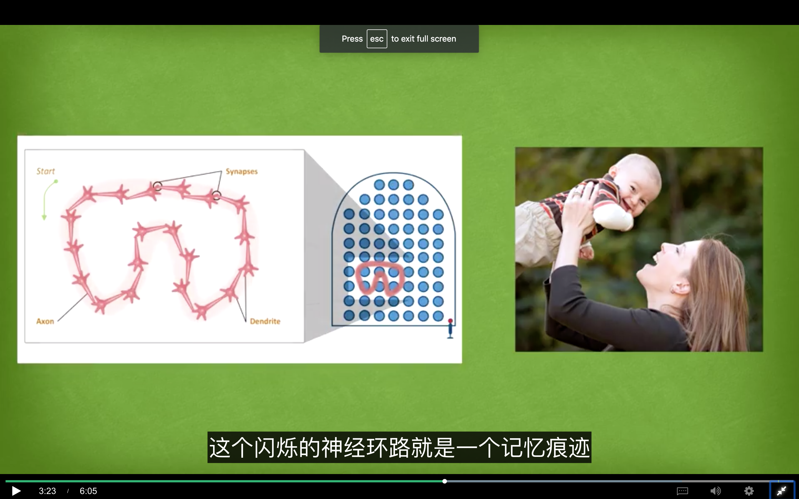

# 什么是组块？

在这个视频里，我们要回答一个问题，到底什么是组块(chunk)？

> 组块：why，为什么使用组块

在你第一次见到一个全新的概念时，它有时看上去并没有什么意义，就像这堆乱糟糟的拼图。**组块化是一种思维的跃进，根据意义将信息碎片拼接起来，而新的逻辑整体让组块更容易记忆；同时也可以让你更轻松地将组块整合到所学内容的大框架内。** 在不加理解或不关注上下文的情况下，单纯的死记硬背并不能帮助你理解其真正内涵或者理解这个概念与你正在学习的其他概念之间的关联，这样的话，这个概念拼图就没有可以拼合的边缘，无法让它关联到其他的拼图碎片上。

> 专注模式：what，why

我们之前谈到过工作记忆，也谈到过工作记忆的四个插槽，如何在前额叶皮质区域工作，前额叶皮质指的是你额头正后方的那个脑部区域。当你全神贯注在某件事上的时候，就好像你的脑子里有一只章鱼，这只注意力的章鱼会在必要时把它的触须穿过工作记忆的四个插槽，从而帮助你把可能分布于大脑不同区域里的信息给联系起来。注意，这和发散模式下的随机连接不一样。**集中注意力，从而将大脑的不同部分连接起来，并将不同的想法联系在一起，是专注模式下学习的重要部分。它也常常帮助组块的初始创建。** 有趣的是，在你很紧张的时候，你的注意力章鱼会失去一些连接能力，这也是在你生气、紧张、害怕的时候，大脑似乎不能正常工作的原因所在。

> 组块：what-定义/含义

从神经科学的角度说，**组块就是通过使用或意义连接在一起的信息碎片**。你可以把 P O 和 P 三个字母连接在一起，形成一个有意义且容易记忆的组块，也就是单词 POP，有点像把一个笨重的电脑文件压缩成 ZIP 文件。在这一个 pop 组块里，存在的是神经元的交响乐，而神经元们的声音也都相互协调。复杂的神经活动把简化而抽象的思想组块结合在一起，而这些思想，无论是缩写、灵感还是概念，都是大多数科学、文学和艺术的基础。举个例子，假如说你想学西班牙语，对于在说西班牙语的家庭里长大的孩子，学西班牙语就和呼吸一样自然，你妈妈说“mama”，你也会跟着说一句“mama”【老师口误 西语 mamá 重音在后】。接着你的神经元就会发动形成一个闪烁的心理环路，这个环路可以巩固你意识里“妈妈”这个词与母亲的笑脸之间的联系，这个闪烁的神经环路就是一个记忆痕迹，当然这个记忆痕迹也会和其他很多相关的记忆痕迹连接起来。

很多优秀的语言学习项目，比如我学俄罗斯语的国防语言学院，都是通过结构性的重复和强记练习，也就是用专注模式学习语言，同时运用和母语国家的人的自由交流，即用类似发散模式的方法，其目的就是让你铭记基础的词汇和搭配，这样你说新的语言也能像说母语那样自由和富有创造力了。**事实上，在某个学术领域获得专业知识的第一步都是创建出概念组块，这种根据意义将信息碎片拼接起来的思维跃进**。神经组块的概念也可以运用于其他人类能够掌握的领域，如运动、音乐、舞蹈等。**本质上说，组块就是让多个神经元共同运作的网络**。只有这样你才能平稳有效地进行思考和完成动作。**专注的训练和重复可以建立强的记忆痕迹，从而帮助你创建组块。专业的培养是一小步一小步的，这个过程中小的组块可以形成更大的组块，而且随着你对学习材料的理解越来越深入，所有的专业知识都只是更有创造性的更有见解的铺路石**。换句话说，仅通过联系和重复来创建组块，并不能使你得心应手、有创造力地运用所学内容，这一点后面还会再讲。**组块化可以让大脑工作得更有效，一旦你把某个想法、概念或动作组块化后，你就不再需要记住和这个想法、概念或动作有关的全部细节，你只需要知道最主要的那个概念就行了，也就是只需要记住组块**。这就像清晨起床穿衣服，你只需要一个简单的想法，像“我要穿衣服”，但细想你会发现这个简单想法的组块所包含的活动是非常复杂的。

下节课我们会讲组块的形成。我是芭芭拉·奥克利。谢谢选修“如何学习”。
