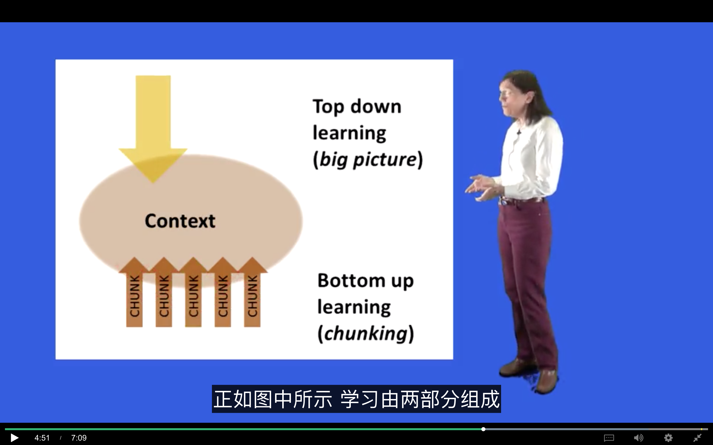
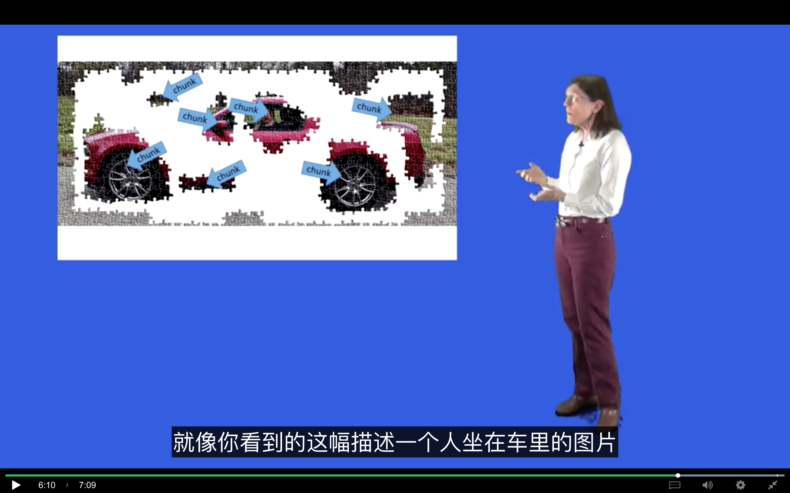
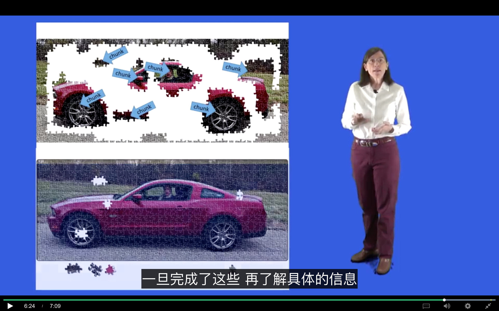

# 怎样形成组块——第 2 部分

这节课，我将带领你了解建立组块的一些基本方法。每一种方法都不尽相同。

从历史角度来看，“组块”的概念和其他学科有很大的不同，比如说它和化学中的“组块”或是空手道中的“套路”就大相径庭。我在这里讲解的组块化，更多的偏向于意识层面而非肌体活动。但是你会发现这两种不同的形态间有着紧密的联系。因此，无论你学习的东西是精神上的还是生理上的，你都会得到一些启发。

**组块化的第一步，便是对你想要组块化的信息全神贯注。** 如果你正开着电视或是每隔几分钟就检查、回复手机或电脑上的消息，这些都会增加你建立组块的难度，因为你的大脑并没有完全投入到新信息的组块化中去。**当学习一些新东西时，你会建立新的神经模型，然后把它和之前存在的模型联系起来(注解：类比方法就是这个原因)，并且散播到大脑中的各个位置**。打个比方，你的思维就像是章鱼的触角，当其他的事情占用有限的工作记忆时，它就无法触及到新知识的各个方面。

> 组块化的第二步，要求你对建立组块的对象有基本的了解（understand），这种了解也就是理解。理解就像是强力胶，将潜在的记忆痕迹粘合在一起，它可以建立起一大圈记忆痕迹，并和其他痕迹链接起来。

**组块化的第二步，要求你对建立组块的对象有基本的了解。** 无论是理解概念性的知识，如大陆漂移学说（Continental Drift），还是寻找故事中不同情节间的关联，或是弄明白经济学中的供求关系，抑或是领会某种数学问题的本质，通常同学们都可以自然而然地领会所学内容的大意，弄明白老师到底讲了什么，或者如果他们愿意轮流使用专注模式和发散模式来帮助思考，他们至少可以理解老师讲的大意。**理解就像是强力胶，将潜在的记忆痕迹粘合在一起，它可以建立起一大圈记忆痕迹，并和其他痕迹链接起来。** 你可以对没有理解的知识建立组块吗？可以，但它们通常是无用的组块，无法融入或者与你学习的其它材料相结合。

由此看来，认识到如何解决一个问题是非常重要的。比如说，你没有必要为自己能够轻松回想起的内容建立组块，不要把类似“啊哈”这样的小结论和扎实的专业知识搞混，这就是你能理解老师在课上所讲授内容的原因之一。但如果你在初次学习后没有及时进行复习，而等到考试之前再复习，你就会觉得这些知识难以理解了。

> 如何做才能建立起组块？

对于数学和科学的相关学科来说，关上书本，检测自己，能够帮你检验那些你以为已经明白了的问题，并且能够加快你的学习速度。**你应该明白，当你能独自完成某件事时，你才是真正掌握了它。** 许多事情都是这个道理，就像你只是看别人画画，并不代表你也能画出来，仅仅听别人唱歌并不能使你拥有同样的唱功和洪亮的嗓音。**某件事如果你只是在看，或者就算理解了如何去做，也不代表你能真正做到，只有在你自己实际操作和完全掌握的情况下才能建立起神经模型。**

**建立组块的第三步，是获取背景知识。** **这样你就不仅知道如何使用组块，还明白应该什么时候用它。背景是指超越最初的问题，看得更宽更远。不断重复和练习相关的或是不相关的问题，这样你就能知道何时该使用组块，何时不使用它，这样做能帮你认识新建立的组块是如何融入整体框架的。** 换句话说，在你的问题解决策略工具箱中有一件工具，如果你不知道何时该用它，它对你来说意义就不大。

**最终，练习能帮你拓宽组块连接的神经网络，并确保它们不仅仅是牢固的，而且能够通过不同的途径进行访问**。正如图中所示，**学习由两部分组成，由上而下的认识和由下至上的组块化** 。在由下至上组块化的过程中，练习和重复能够帮助你建立和强化每一个组块，这样你就可以在任何需要它的时候使用它。当然，由上而下的方法，能够让你清楚地看到你正在学习什么以及它适用于哪里。就完全掌握学习材料而言，这两个过程都非常重要。背景认识（context）就是这两个过程的交汇处 。特别说明，组块化包含一种方法，即在学习中解决特定问题的方法。背景认识意味着学会在特定的时候使用正确的方法。

在真正的阅读之前，快速浏览书中某一章的图片以及小标题，能够帮助你知晓大意。听那些有严谨层次结构的课程，可以帮你弄清楚应在哪里建立组块，以及如何把不同组块联系起来，就像你看到的这幅描述一个人坐在车里的图片。

在看书前先弄清楚大意或书中的观点，它们是引言的关键部分，或是书本章节大纲、流程图、图表或是概念图。一旦完成了这些，再了解具体的信息，就算在最后遗漏了一些让你疑惑的部分，你依然可以理解主要部分。

> 总结

好了，最好在精神高度集中的时候建立组块；理解基本的含义；通过练习来真正掌握知识；并对情境有个大致了解，以上都是建立组块的一些基本步骤。你可以把“组块”融入到你正在使用的学习方法中去。

更多的内容，下节课继续，我是芭芭拉·奥克利。谢谢选修“如何学习”。
