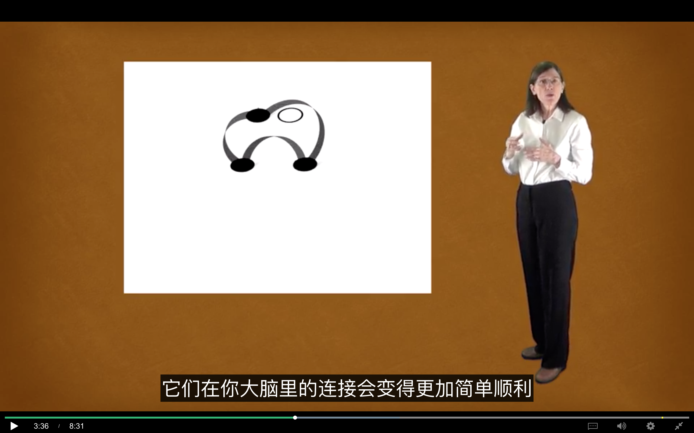

# 能力错觉

本节我们将讨论的是，一些让学习走上正轨的基本理念：即回顾的重要性、在学习中对(某种)能力的错觉、小测验、以及犯错的意义。

> 回顾是一种有效工具

学习书本或笔记资料时最常见方法之一，就是反复阅读。**不过心理学家 Jeffrey Karpicke 证明，事实上这种方法的成效远不及另一种简单技巧---回顾：阅读材料后，移开视线，看看你能回忆起多少内容。** Karpicke 发表在《科学》杂志上的研究，运用以下这些方法提供了可靠证据。先让学生们学一篇科技文本，然后通过尽力回忆其中信息来巩固练习。接着，他们重读并再次回想，也就是再一次努力记住核心思想。结果是，相同时间内，仅用回顾法练习的学生，比使用其他学习方法的学生而言，对材料的掌握更为全面深入。其他学习方法包括反复阅读资料，或者绘制据说可以加强学习材料之间联系的思维导图。学生通过正式考试或非正式自测，都证明了(回顾法)有助于学习。这给了我们一个重要提示，**即在回顾知识时，我们并非机械地复述，而是在通过回顾这个过程加深理解。这也有助于我们形成知识组块，就好像回忆过程帮助我们在神经上嵌入了“钩子”，以便我们串联起前后知识。**

更让研究者们出乎意料的是，学生们预计单纯地阅读和回顾材料并不是最佳的学习方法，他们认为思维导图，即画出概念之间的联系才是最佳途径。然而根基还没打牢就开始空建框架联系，实属徒劳无功，这就好像你连最基本的走棋规则都不懂 却想学懂国际象棋的高级策略一样欲速则不达。

**比起被动重复阅读，回顾，即在心里检索关键概念可以使你的学习更加专注高效。只有隔上一定时间后再重读才会有效果，因为这样，重读就更像是间隔重复练习。**

> 以下是其中一种看待学习和回忆的方式

以下是其中一种看待学习和回忆的方式。正如我们之前所讲，在工作记忆中有四个插槽，当你第一次学习理解一个概念或者解题技巧时，你的工作记忆会被完全调动。如图所示，四个工作记忆插槽之间的连接错综复杂。当你开始将概念组块化，它们在你大脑里的连接会变得更加简单顺利。一旦概念被组块化，它就只会占用一个工作记忆插槽，同时变成容易遵循的成熟思路，并可以用来建立新的联系，剩下的工作记忆被清空。从某种意义来说，零散的组块化策略，增加了工作记忆中可以容纳的信息数量。工作记忆的插槽，就像是一个链接巨大网页的超链接。

现在，你该明白，为什么你才是解决问题和掌握概念的主体，而不是习题解答手册或专业课本的作者。举个例子，如果你看到答案后告诉自己，对，我明白他们为什么这么做，那么这个答案并不真正属于你。你没有把这些概念嵌入自己潜在的神经回路中去，仅仅是扫一眼答案就以为你真的理解了，是一种学习中最为常见的自欺欺人式错觉。如果你想要很好地掌握材料以在考试中取得好成绩，并可以从中创新，则必须让这些知识在你脑海里生根发芽。另一个类似情况就是，你可能会惊讶地发现，做笔记时高亮和下划线必须要谨慎，否则不仅没有效果还容易产生误导，就好像手上比划了半天，你就会误以为自己已经记住了这些概念一样。如果你要做标记，试着在勾画前找到中心思想，并试着尽量减少划线和高亮的内容，每段不超过一句，另一方面，在空白处写笔记总结关键概念是一种很好的办法。

Jeff Karpicke 就是那位对“回顾法”做了重要研究的学者，对其相关课题-学习时对能力的错觉，也有研究。学生们喜欢重读笔记或课本的原因是，当他们面前打开着课本或谷歌时，会误以为这些知识同样在他们的脑海里。然而事实却并非如此，因为看书比回顾做起来简单。但学生们会陷入(一种自欺欺人的)错觉，这种学习方式效率很低。

这提醒我们，在学习资料上花太多时间并不能保证你真的懂了，自测是一种极其有用的办法，来确保你是真的学会了，而不是自欺欺人的错觉。

从某种意义上来说，这就是回忆在发挥作用，让你发现自己是否真的掌握一个概念。做事时犯错实际上是件好事，因为你之后就会想要避免重复犯错。所以实际考试前，在自测中犯的错是很有价值的，因为它们能让你一点点弥补思维漏洞，犯错可以纠正思考方向，让你学得更好，做得更好。

正如你知道的，回顾是一种有效工具。不过这里有另一个小贴士，在常规学习场所以外回顾材料，会帮助你加深对材料的理解。你可能没有意识到这一点，但是当你学习新事物的时候，你通常会把最开始接触材料的地方，当作潜意识中的提示，但一到考试就乱了阵脚。因为考试与学习场所通常不同，通过在不同物理环境下回顾和思考学习资料，你会脱离对给定场所的依赖，这会帮助你避免由于考试与学习场所的不同而产生的问题。

我是芭芭拉·奥克利，感谢选修“如何学习”。
