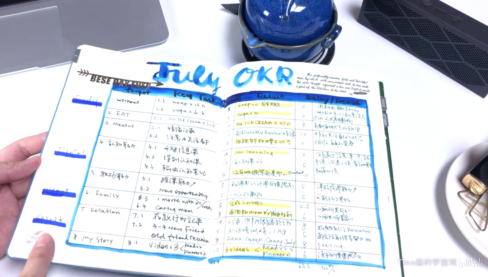
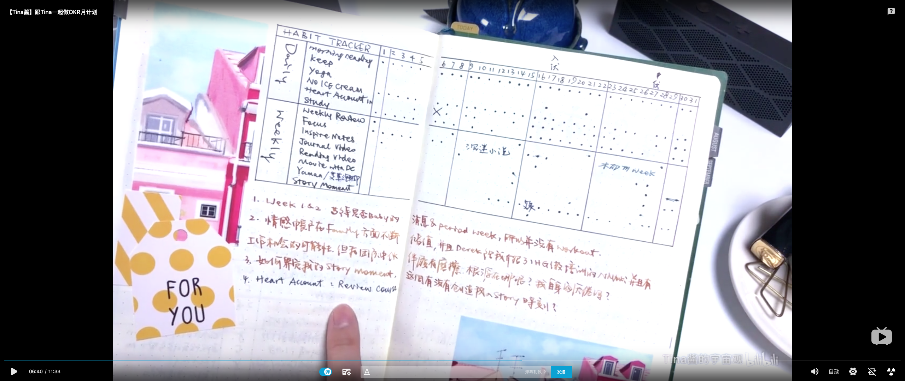

# OKR 计划+把时间当作朋友方法

## 目标（任务）细分拆解

例子：

一级目标 1 --> 二级目标 1、二级目标 2 ... 二级目标 n --> 三级... --> Key Task --> 步骤 1、2、3...

- Key Task :量化的任务/目标。量化的含义是，在计划周期需要完成的任务量（一个月减肥 6 斤，或每周跑步至少 4 次，每次 50m）。量化的好处是，可以为之后评估时间做参考。
- 步骤：在量化任务/目标后，细分拆解每个任务的完成步骤，每个步骤具体到一天的时间段上

## 评估完成情况

- 成功

  记录完成的时间

- 失败

  记录原因。比如延迟，记录延迟的原因

- 打卡（日打卡/周打卡）

