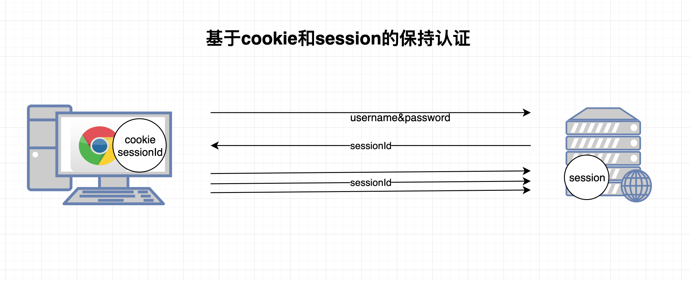
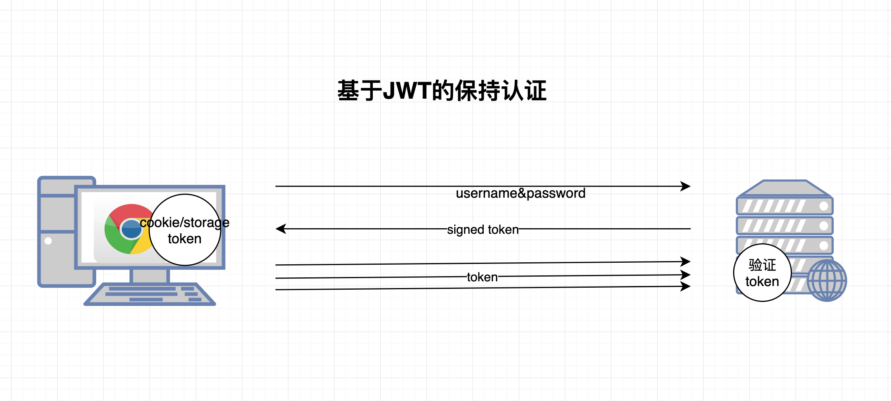
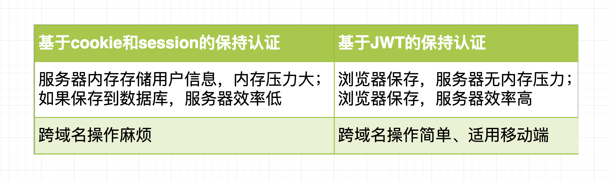

# 认证&授权的基础知识

## 认证 & 授权

- 认证

认证（authentication）： 是身份验证/认证，也就是根据用户提交的用户名和密码，验证是否有这个用户

- 授权

授权（authorization）：不同的用户角色有不同的权限，即普通用户不能访问管理员的 API

## 为什么认证和保持认证

- 用户要增删改查自己的数据
- 用户不必短时间内每次都输入用户名和密码

## 为什么授权

- 不同的用户角色有不同的权限，即普通用户不能访问管理员的 API

## 保持认证的两种方式

### 基于 cookie-session 的保持认证

### 基于 Token 的保持认证

### 两种方式的对比

## JWT-JSON Web Token

[JWT 入门](../jwt.md)
