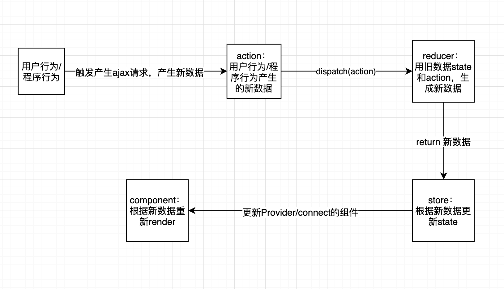

# redux 入门

redux 的基本概念和基本问题的总结

## 为什么使用 redux

### redux 要解决什么问题？

1. 解决 react 带来的问题：
   React 只是 DOM 的一个抽象层，并不是 Web 应用的完整解决方案。有两个方面，它没涉及。一个是，代码结构；一个是，组件之间的通信。对于大型的复杂应用来说，这两方面恰恰是最关键的。**因此，只用 React 没法写大型应用。**

   为了解决这个问题，2014 年 Facebook 提出了 Flux 架构的概念，引发了很多的实现。2015 年，Redux 出现，将 Flux 与函数式编程结合一起，很短时间内就成为了最热门的前端架构。

2. 在遇到这些情况时，需要 redux：

   - Redux 的适用场景（多交互、多数据源）：

     - 用户的使用方式复杂
     - 不同身份的用户有不同的使用方式（比如普通用户和管理员）
     - 多个用户之间可以协作
     - 与服务器大量交互，或者使用了 WebSocket
     - View 要从多个来源获取数据

   - 从组件角度看，如果你的应用有以下场景：
     - 某个组件的状态，需要共享
     - 某个状态需要在任何地方都可以拿到
     - 一个组件需要改变全局状态
     - 一个组件需要改变另一个组件的状态

发生上面情况时，如果不使用 Redux 或者其他状态管理工具，不按照一定规律处理状态的读写，代码很快就会变成一团乱麻。因此，需要 redux，可以在同一个地方查询状态、改变状态、传播状态的变化。

### 还有什么别的解决方案？

Redux 只是 Web 架构的一种解决方案（Flux 架构），也可以选择其他架构方案。

其他架构方案：

- MVC
- MVVM
- Observer
- Reactive

### redux 跟他们的区别是什么，有什么优点或缺点？

## 基本概念：redux 是什么 & 怎么用

### 设计思想

Redux 的设计思想很简单：

（1）Web 应用是一个状态机，视图与状态是一一对应的。

（2）所有的状态，保存在一个对象里面。

状态就是数据

### store

负责保存数据。

##### 创建 store

```js
import { createStore } from 'redux'
const store = createStore(fn)
```

##### state

- state 是什么

Store 对象包含所有数据。如果想得到某个时点的数据，就要对 Store 生成快照。这种时点的数据集合，就叫做 State。当时间为 t1 时，程序状态为 state1；当时间为 t2 时，程序状态为 state2。

本质上，state 就是程序数据。

- 获取 state 数据

```js
import { createStore } from 'redux'
const store = createStore(fn)

const state = store.getState()
```

当前时刻的 State，可以通过 store.getState()拿到。
Redux 规定， 一个 State 对应一个 View。只要 State 相同，View 就相同。你知道 State，就知道 View 是什么样，反之亦然。

##### store.dispatch()

通过 store.dispatch()把新数据 action 发送给 reducer。
store.dispatch()是 View 发出 Action 的唯一方法。

```js
import { createStore } from 'redux'
const store = createStore(fn)

store.dispatch({
  type: 'ADD_TODO',
  payload: 'Learn Redux'
})
```

上面代码中，store.dispatch 接受一个 Action 对象作为参数，将它发送出去。

结合 Action Creator，这段代码可以改写如下。

```js
store.dispatch(addTodo('Learn Redux'))
```

##### store.subscribe()

订阅状态树 state 的变化。
Store 允许使用 store.subscribe 方法设置监听函数，一旦 State 发生变化，就自动执行这个函数。

```js
import { createStore } from 'redux'
const store = createStore(reducer)

store.subscribe(listener)
```

显然，只要把 View 的更新函数（对于 React 项目，就是组件的 render 方法或 setState 方法）放入 listen，就会实现 View 的自动渲染。

store.subscribe 方法返回一个函数，调用这个函数就可以解除监听。

```js
let unsubscribe = store.subscribe(() => console.log(store.getState()))

unsubscribe()
```

### reducer

#####reducer 是什么

负责更新数据，用旧数据 state 和 action 生成新数据。

（Store 收到 Action 以后，必须给出一个新的 State，这样 View 才会发生变化。这种 State 的计算过程就叫做 Reducer。）

##### 语法上，Reducer 是一个函数

它接受 Action 和当前 State 作为参数，返回一个新的 State。

```js
const reducer = function(state, action) {
  // ...
  return new_state
}
```

##### 建立 reducer 与 store 的关系

实际应用中，store.dispatch 方法会触发 Reducer 的自动执行。为此，Store 需要知道 Reducer 函数，做法就是在生成 Store 的时候，将 Reducer 传入 createStore 方法。

```js
import { createStore } from 'redux'
const store = createStore(reducer)
```

上面代码中，createStore 接受 Reducer 作为参数，生成一个新的 Store。以后每当 store.dispatch 发送过来一个新的 Action，就会自动调用 Reducer，得到新的 State。

##### 为什么这个函数叫做 Reducer 呢？

因为它可以作为数组的 reduce 方法的参数。请看下面的例子，一系列 Action 对象按照顺序作为一个数组。

```js
const actions = [
  { type: 'ADD', payload: 0 },
  { type: 'ADD', payload: 1 },
  { type: 'ADD', payload: 2 }
]

const total = actions.reduce(reducer, 0) // 3
```

上面代码中，数组 actions 表示依次有三个 Action，分别是加 0、加 1 和加 2。数组的 reduce 方法接受 Reducer 函数作为参数，就可以直接得到最终的状态 3。

### action

#### 含义

action 是新数据，用户行为（或程序行为）产生的新数据。

State 的变化，会导致 View 的变化。但是，用户接触不到 State，只能接触到 View。所以，State 的变化必须是 View 导致的。Action 就是 View 发出的通知，表示 State 应该要发生变化了。

#### 语法上，action 是个对象

Action 是一个对象。其中的 type 属性是必须的，表示 Action 的名称。其他属性可以自由设置，社区有一个规范可以参考。

```js
const action = {
  type: 'ADD_TODO',
  payload: 'Learn Redux'
}
```

上面代码中，Action 的名称是 ADD_TODO，它携带的信息是字符串 Learn Redux。

可以这样理解，Action 描述当前发生的事情。改变 State 的唯一办法，就是使用 Action。它会运送数据到 Store。

#### action creator

View 要发送多少种消息，就会有多少种 Action。如果都手写，会很麻烦。可以定义一个函数来生成 Action，这个函数就叫 Action Creator。

```js
const ADD_TODO = '添加 TODO'

function addTodo(text) {
  return {
    type: ADD_TODO,
    text
  }
}

const action = addTodo('Learn Redux')
```

上面代码中，addTodo 函数就是一个 Action Creator。

### store/reducer/action 之间的关系

## Store 的实现

Store 提供了三个方法。

- store.getState()
- store.dispatch()
- store.subscribe()

```js
import { createStore } from 'redux'
let { subscribe, dispatch, getState } = createStore(reducer)
```

createStore 方法还可以接受第二个参数，表示 State 的最初状态。这通常是服务器给出的。

```js
let store = createStore(todoApp, window.STATE_FROM_SERVER)
```

上面代码中，window.STATE_FROM_SERVER 就是整个应用的状态初始值。注意，如果提供了这个参数，它会覆盖 Reducer 函数的默认初始值。

下面是 createStore 方法的一个简单实现，可以了解一下 Store 是怎么生成的。

```js
const createStore = reducer => {
  let state
  let listeners = []

  const getState = () => state

  const dispatch = action => {
    state = reducer(state, action)
    listeners.forEach(listener => listener())
  }

  const subscribe = listener => {
    listeners.push(listener)
    return () => {
      listeners = listeners.filter(l => l !== listener)
    }
  }

  dispatch({})

  return { getState, dispatch, subscribe }
}
```

## reducer 的拆分

为了开发维护方便。
Reducer 函数负责生成 State。由于整个应用只有一个 State 对象，包含所有数据，对于大型应用来说，这个 State 必然十分庞大，导致 Reducer 函数也十分庞大。

请看下面的例子。

```js
const chatReducer = (state = defaultState, action = {}) => {
  const { type, payload } = action
  switch (type) {
    case ADD_CHAT:
      return Object.assign({}, state, {
        chatLog: state.chatLog.concat(payload)
      })
    case CHANGE_STATUS:
      return Object.assign({}, state, {
        statusMessage: payload
      })
    case CHANGE_USERNAME:
      return Object.assign({}, state, {
        userName: payload
      })
    default:
      return state
  }
}
```

上面代码中，三种 Action 分别改变 State 的三个属性。

- ADD_CHAT：chatLog 属性
- CHANGE_STATUS：statusMessage 属性
- CHANGE_USERNAME：userName 属性

这三个属性之间没有联系，这提示我们可以把 Reducer 函数拆分。不同的函数负责处理不同属性，最终把它们合并成一个大的 Reducer 即可。

```js
const chatReducer = (state = defaultState, action = {}) => {
  return {
    chatLog: chatLog(state.chatLog, action),
    statusMessage: statusMessage(state.statusMessage, action),
    userName: userName(state.userName, action)
  }
}
```

上面代码中，Reducer 函数被拆成了三个小函数，每一个负责生成对应的属性。

这样一拆，Reducer 就易读易写多了。而且，这种拆分与 React 应用的结构相吻合：一个 React 根组件由很多子组件构成。这就是说，**子组件与子 Reducer 完全可以对应**。

### combineReducers

Redux 提供了一个 combineReducers 方法，用于 Reducer 的拆分。你只要定义各个子 Reducer 函数，然后用这个方法，将它们合成一个大的 Reducer。

```js
import { combineReducers } from 'redux'

const chatReducer = combineReducers({
  chatLog,
  statusMessage,
  userName
})

export default todoApp
```

上面的代码通过 combineReducers 方法将三个子 Reducer 合并成一个大的函数。

#### State 的属性名与子 Reducer 同名

这种写法有一个前提，就是 State 的属性名必须与子 Reducer 同名。如果不同名，就要采用下面的写法。

```js
const reducer = combineReducers({
  a: doSomethingWithA,
  b: processB,
  c: c
})

// 等同于
function reducer(state = {}, action) {
  return {
    a: doSomethingWithA(state.a, action),
    b: processB(state.b, action),
    c: c(state.c, action)
  }
}
```

总之，combineReducers()做的就是产生一个整体的 Reducer 函数。该函数根据 State 的 key 去执行相应的子 Reducer，并将返回结果合并成一个大的 State 对象。

#### 下面是 combineReducer 的简单实现

```js
const combineReducers = reducers => {
  return (state = {}, action) => {
    return Object.keys(reducers).reduce((nextState, key) => {
      nextState[key] = reducers[key](state[key], action)
      return nextState
    }, {})
  }
}
```

你可以把所有子 Reducer 放在一个文件里面，然后统一引入。

```js
import { combineReducers } from 'redux'
import * as reducers from './reducers'

const reducer = combineReducers(reducers)
```

## redux 流程



## 参考

- [Redux 入门教程（一）：基本用法](http://www.ruanyifeng.com/blog/2016/09/redux_tutorial_part_one_basic_usages.html)

- [React 技术栈](https://github.com/ruanyf/jstraining/blob/master/docs/react.md)
